# Aineer 产品与技术设计方案

> **第一性原理：绝不将就。** 不合适的、过时的通通删掉。在全新画布中肆意作画。
> 旧代码（`../aineer-legacy/`）和 Zed（`../zed/`）仅作为营养来源。

本方案分为三大篇章：

- **篇一 · 产品设计** — 定义 Aineer 是什么、为谁服务、怎样赢
- **篇二 · UI 设计系统** — 系统性的视觉规范与组件标准，指导全部界面实现
- **篇三 · 技术架构与实施** — 代码结构、数据模型、实施路线

---

# 篇一 · 产品设计

---

## 1. 核心产品理念

### 1.0 产品定义

> **Aineer** — 首个 ADE（代理式开发环境, Agentic Development Environment）。

一句话：**Aineer 是首个 ADE——AI Agent 不只是功能，而是环境本身。它看得到你在做什么，记得住你做过什么，能替你完成你想做的事。**

传统终端是哑巴。AI 聊天工具是瞎子。IDE 里的 AI 是附庸。Aineer 开创了一个新品类——**ADE（代理式开发环境）**：一条统一的信息流中，Shell 命令、AI 对话、Agent 自主执行自然交织——AI Agent 不是被"集成"到环境里，它**就是**环境。

**ADE vs 现有品类：**

| 品类            | 代表产品           | AI 角色             | Aineer 的差异              |
| --------------- | ------------------ | ------------------- | -------------------------- |
| Terminal        | iTerm2, Alacritty  | 无 AI               | AI 是环境的一等公民        |
| AI Terminal     | Warp               | AI 是附加功能       | AI 是环境本身              |
| Code Editor     | VS Code            | 无 AI               | 面向运行与调试，非编写     |
| AI Code Editor  | Cursor, Zed        | AI 辅助编辑         | AI 自主执行，不只回答问题  |
| AI Coding Agent | Claude Code, Aider | 纯 CLI，无 GUI      | 结构化 Block 流 + 可视化   |
| **ADE**         | **Aineer**         | **AI Agent 即环境** | **Think + Remember + Act** |

### 1.0b 三支柱模型

Aineer 的产品能力围绕三根支柱构建：

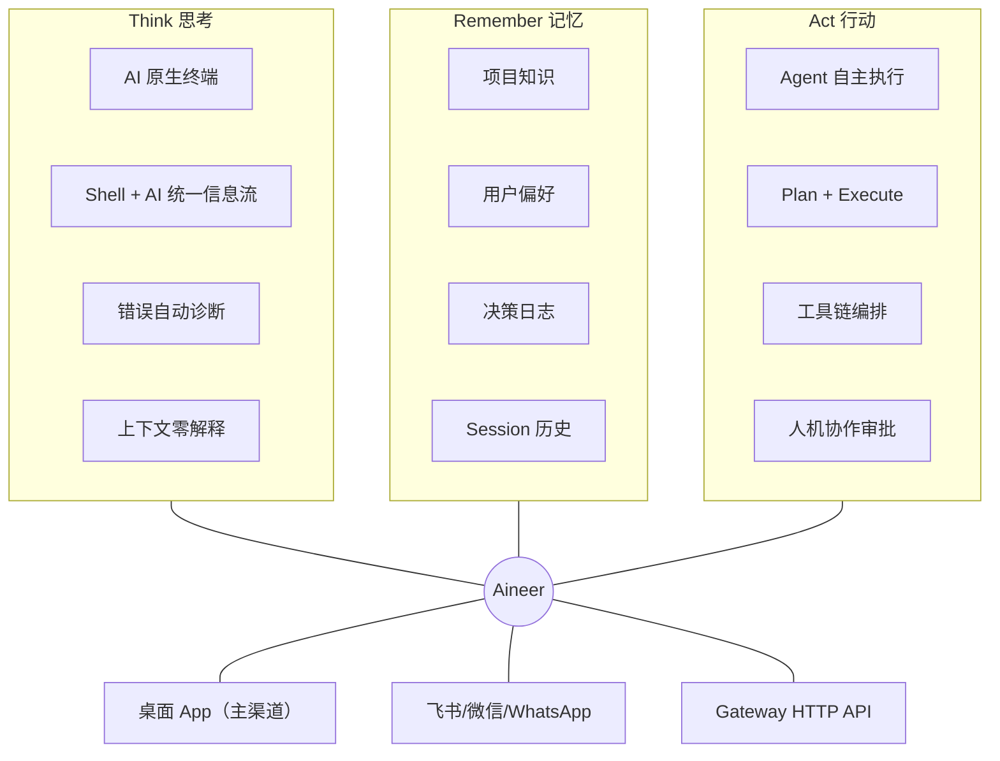

| 支柱                                                | 用户价值                       | 对标竞品缺失                 |
| --------------------------------------------------- | ------------------------------ | ---------------------------- |
| **Think** — AI 能看到终端上下文，自动理解你在做什么 | 出错时不用解释，AI 直接诊断    | Warp/iTerm2 无上下文感知     |
| **Remember** — AI 记住项目、偏好、历史决策          | 越用越懂你，不重复回答相同问题 | 所有竞品每次从零开始         |
| **Act** — AI 不只回答，还能规划和执行多步操作       | "部署到 staging" 一句话搞定    | Cursor/Zed 无终端 Agent 模式 |

**ADE 核心架构洞察：** Provider 只有一套，Memory 只有一份，能力只注册一次。桌面 Shell+Chat、飞书、微信、Gateway 只是**同一个 AI Agent 的不同入口**。这就是 ADE——Agent 不是被"装进"环境，Agent 就是环境。

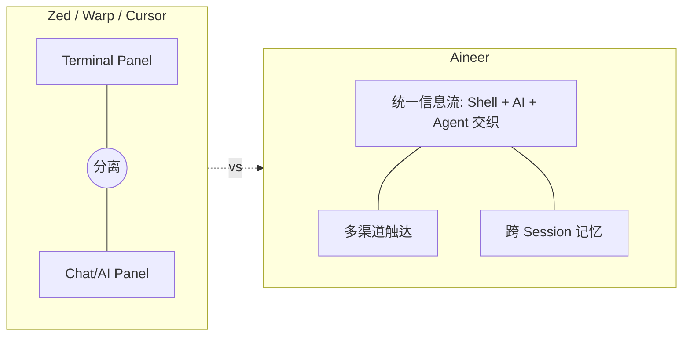

### 1.1 目标用户画像

**主要用户：全栈/后端开发者**

- 日常大量使用终端（git、docker、kubectl、npm、cargo...）
- 已在用 AI 辅助编程（Cursor/Copilot/Claude），但在终端中仍是"裸奔"
- 痛点：终端和 AI 是两个世界，要不断复制粘贴错误信息去问 AI
- 期望：终端就能理解我在做什么，出错时不需要我解释上下文

**次要用户：DevOps / SRE**

- 大量 SSH、日志分析、脚本运行
- 痛点：看日志报错要自己分析，写一次性脚本很费时间
- 期望：AI 能看到我的终端输出，直接帮我分析和生成修复命令

**排除用户（当前阶段不针对）：**

- 纯 GUI 偏好的开发者（他们用 VS Code + 鼠标）
- 非技术用户

### 1.2 竞品差异化定位

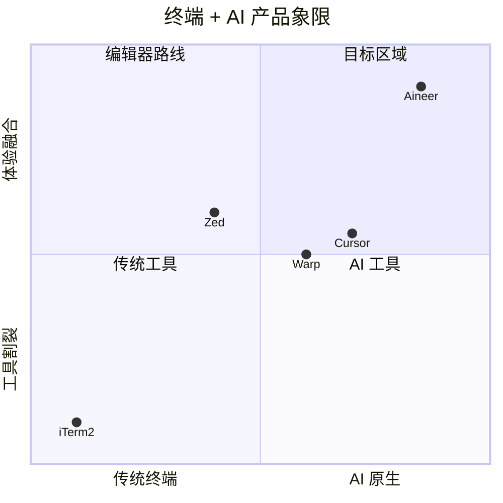

- **vs Warp**：Warp 的 Block 是"命令+输出"的容器，AI 是附加功能。Aineer 的 Block 把 Shell、AI、工具编织成统一信息流，AI 是一等公民。且 Warp 无跨 Session 记忆、无 Agent 模式、无多渠道触达
- **vs Zed**：Zed 的终端是编辑器的附属面板。Aineer 的终端**就是**主界面，编辑器功能是终端的扩展。Zed 的 AI 不理解终端上下文，无法自动诊断命令错误
- **vs Cursor**：Cursor 的 AI 集成在编辑器内。Aineer 的 AI 集成在终端内，面向"运行和调试"场景而非"编写代码"场景。两者互补而非替代——Cursor 写代码，Aineer 运行和调试
- **vs Claude Code / Aider**：纯 CLI AI 工具，无 GUI、无结构化 Block、无文件树、无 Diff 预览。Aineer 提供完整的图形化体验
- **vs GitHub Copilot CLI**：仅命令建议，无上下文感知、无持久记忆、无 Agent 执行能力

**ADE 的护城河（Moat）：**

1. **新品类定义权**：Aineer 定义了 ADE（代理式开发环境）这个新品类——AI Agent 即环境，不是插件
2. **Agent 自主执行**：不只是回答问题，而是能自主规划和执行多步终端操作（Plan+Execute）
3. **跨 Session 记忆**：越用越聪明，形成用户粘性——换到其他工具意味着失去 AI 对你的理解
4. **多渠道统一 Agent**：桌面端、手机端、HTTP API 共享同一个 AI Agent，这是独有的架构优势
5. **Spec-Driven Development**：原生支持 OpenSpec，规格文档驱动 AI 行为

### 1.3 设计原则

1. **终端是画布，不是面板** — 主视图是一条时间线上的 Block 流，不是窗口中的一个小面板
2. **AI 是环境音，不是广播** — AI 不需要"打开"或"切换"，它始终在场，在你需要时才发声
3. **结构化历史，不是文本瀑布** — 每条命令和每次对话是独立的可寻址对象，不是终端缓冲区里的字符海洋
4. **渐进式披露** — 默认简洁，一个 Block 折叠时只占一行摘要；展开后才显示完整输出
5. **键盘优先，鼠标友好** — 所有操作有快捷键，但也有直觉性的鼠标路径
6. **速度感知 > 实际速度** — 即使 AI 需要 2 秒响应，也要在 200ms 内给用户视觉反馈
7. **AI 越用越懂你** — 不是每次从零开始；记忆让 AI 理解你的项目、习惯、偏好，像一个真正的搭档
8. **可分享的一切** — Block、Session、Skill 都有 permalink，可以分享给同事或社区

### 1.3b 爆款产品的 "Magic Moments"

一个产品能否成为爆款，取决于用户是否会在前 5 分钟内遇到一个"不可能回到旧世界"的时刻。

**Magic Moment 1: 错误诊断（目标：首次使用 60 秒内触发）**

```
用户输入 cargo build → 编译失败 → 0.5 秒后 AI 气泡浮出：
"类型不匹配，修复方法：xxx" → 用户点 [Run] → 修好了 → "我再也不想回 iTerm2 了"
```

**Magic Moment 2: 上下文零解释（目标：首次 AI 对话时触发）**

```
用户刚跑了 3 条命令 → Cmd+Enter 问 "为什么部署失败"
→ AI 自动引用了最近 3 条命令的输出作为上下文 → 精准回答
→ "它居然看得到我刚才做了什么？！"
```

**Magic Moment 3: 一键执行（目标：首次 AI 代码块出现时触发）**

```
AI 回复包含 bash 代码块 → 代码块上有 [▶ Run] 按钮
→ 用户点击 → 直接在终端执行 → 输出在下一个 Block 中显示
→ "不用复制粘贴了？！"
```

**Magic Moment 4: 跨 Session 记忆（目标：第二天打开时触发）**

```
第二天打开 Aineer → AI 主动问 "昨天那个部署问题解决了吗？"
→ "它居然记得？！"
```

**Magic Moment 5: 手机上审批（目标：首次使用飞书/微信渠道）**

```
AI 在桌面端执行任务 → 需要审批 rm -rf → 手机飞书收到通知
→ 点击 [允许] → 桌面端继续执行 → "太方便了"
```

这 5 个 Magic Moment 是产品传播的种子——每一个都值得用户发朋友圈/推特。

### 1.4 杀手级体验

**Shell + Chat 融合**

1. **一个输入框，智能模式** -- Enter 发 Shell、Cmd+Enter 发 AI；输入框内置 NLP 意图检测，当检测到自然语言时自动建议切换为 AI 模式（右侧淡入提示），不需用户手动记忆快捷键
2. **Shell 输出用 Zed 级终端渲染** -- ANSI 颜色、光标、选择、超链接，不是纯文本卡片
3. **命令失败时 AI 主动介入** -- 检测非零退出码 → 自动弹出 "AI 诊断"，一键修复
4. **AI 代码块可直接执行** -- ` ```bash ` 块带 [Run] 按钮，点击写入 PTY 执行；多个代码块支持 [Run All] 批量执行
5. **交互式程序无缝切换** -- 检测 alternate screen（vim/htop）→ 全屏终端，AI 可悬浮唤出

**AI Agent 模式（碾压竞品的核心差异化）** 6. **自主多步执行** -- 用户下达高级意图（如 "把这个 PR 部署到 staging"），AI 自动规划步骤（git pull → build → test → deploy）、逐步执行、实时汇报进度 7. **工具链编排** -- Agent 可组合调用 shell 命令、MCP 工具、文件操作、git 操作，形成完整工作流，每一步都在 Block 流中可视化 8. **人机协作审批** -- 危险操作（rm -rf、force push、生产部署）需要用户确认；用户可配置审批策略（全部审批 / 仅危险命令 / 全自动）9. **Plan+Execute 可视化** -- Agent 先展示执行计划（checklist），用户可编辑/调整，确认后自动执行；执行过程中每步状态实时更新（pending → running → done/failed）

**Rich Chat 能力**（不是简陋的文本框，而是完整的聊天体验）10. **附件** -- 拖拽/粘贴文件到输入框，作为 AI 上下文（代码文件、日志文件、配置文件）11. **截图/图片** -- Cmd+Shift+S 截屏 或 粘贴剪贴板图片 → 多模态 AI 分析（UI 截图、错误截图、架构图）12. **@ 引用** -- @file 引用文件、@block 引用历史 Block、@git 引用 diff、@url 引用网页、@memory 引用记忆 13. **/ 命令** -- /fix、/explain、/test、/deploy、/agent 等快捷指令，带自动补全和参数提示 14. **上下文芯片** -- 附件、引用以可视化芯片（Chip）显示在输入框上方，可单独删除 15. **消息内模型切换** -- 对话中可 @model:gpt-4o 随时切换模型，或对同一问题 [Ask Another Model] 获取第二意见

**主动式 AI 行为（不止错误诊断）** 16. **长任务监控** -- 命令运行超过设定阈值（默认 30s）→ AI 气泡提示 "这个命令已运行 2 分钟，要我分析原因吗？" 17. **重复模式识别** -- 检测到用户重复执行相似命令 3 次 → 建议 "要我帮你写成脚本吗？" 18. **危险命令拦截** -- 识别 `rm -rf /`、`DROP TABLE` 等高危命令 → 弹出确认气泡 + AI 解释风险 19. **智能补全增强** -- 基于项目上下文和历史命令的 fish-style ghost text 补全，Tab 接受

**全局搜索（Cmd+P / Cmd+Shift+F）** 20. **Block 搜索** -- 搜索所有历史 Block（命令、AI 对话、工具输出），按时间/类型/关键词过滤21. **跨 Session 搜索** -- 不仅搜索当前 Tab，还能搜索所有历史 Session 的内容 22. **语义搜索** -- 不仅精确匹配，还支持自然语言搜索（如 "上次修 Dockerfile 那个问题"），由 Memory 系统支撑 23. **Command Palette** -- Cmd+Shift+P 打开命令面板，搜索所有命令、设置、快捷键，与 VS Code 一致的肌肉记忆

**上下文面板（Context Panel）** 24. **AI 上下文可视化** -- Sidebar 可切换到 Context 面板，展示 AI 当前 "看到" 的所有上下文：最近 N 条 Block、引用的文件、记忆片段、系统提示词 25. **上下文预算** -- 显示 token 用量进度条（已用 / 上限），用户可手动移除不需要的上下文项，精准控制成本 26. **上下文自动管理** -- 当接近 token 上限时，AI 自动摘要旧 Block 而非简单截断，保留关键信息

**记忆系统** 27. **AI 记住你的项目** -- 项目规则（`.aineer/`）、代码风格、技术栈自动识别，跨 Session 持久化 28. **AI 记住你的偏好** -- 常用命令模式、问题解决路径、个人习惯逐步学习 29. **AI 记住历史决策** -- "上次我们选了 Postgres 而不是 MySQL 因为..."，可召回的决策日志

**多渠道触达** 30. **飞书/微信/WhatsApp** -- 同一个 AI 大脑，在手机上也能下指令、查状态、审批工具调用 31. **Gateway HTTP API** -- 其他工具（Cursor、Continue.dev、自建系统）可接入同一个 AI 后端

**持久化与协作** 32. **每个 Tab = 一个持久化开发对话** -- Shell 历史 + AI 对话 = 可保存/恢复的 Session 33. **Session 分享** -- 一键生成 Session 的只读分享链接（通过 Gateway），同事可查看完整 Block 流 34. **Block 引用链接** -- 每个 Block 有唯一 ID，可生成 `aineer://block/<id>` 链接，在团队中引用特定的命令或 AI 回答

### 1.5 视觉设计关键词

> 详细视觉规范见 **篇二 · UI 设计系统**。此处仅列出产品层面的视觉方向。

**基调：专业、克制、高信息密度**

- 暗色优先，工具感而非消费品感
- 等宽字体为主体（终端），无衬线辅助（AI 正文、UI chrome）
- 通过背景微差区分区域，而非粗线条边框
- 信息密度高于 Warp，低于原始终端
- 克制使用强调色：仅用于活跃状态、错误、AI 标识

### 1.6 核心界面状态机

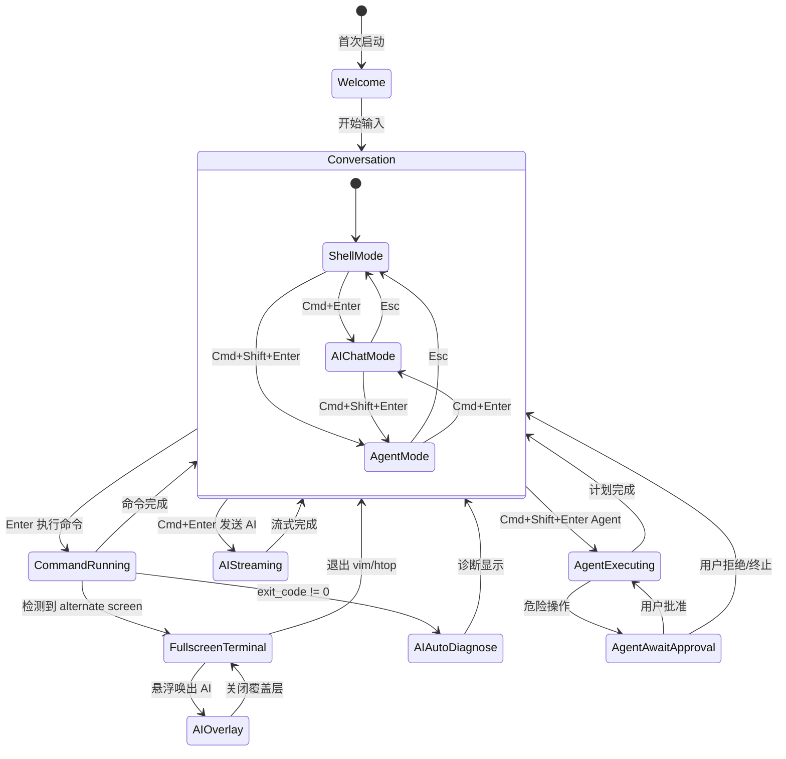

### 1.7 关键界面详解

**A. Welcome 欢迎屏（首次启动 / 新 Tab）**

不是空白画面，而是**有生命力的着陆页**：

```
┌──────────────────────────────────────────────────────┐
│                                                      │
│                  ╭─────────╮                         │
│                  │ AINEER  │  ← logo 带微弱呼吸动画  │
│                  ╰─────────╯                         │
│       The Agentic Development Environment             │
│                   v0.1.0-dev                         │
│                                                      │
│  ┌────────────────┐ ┌────────────────┐ ┌───────────┐│
│  │  ⌨ 输入命令     │ │  🤖 问 AI      │ │ ⚙ 配置   ││
│  │  开始你的工作   │ │  任何问题      │ │ 模型设置  ││
│  └────────────────┘ └────────────────┘ └───────────┘│
│                                                      │
│  📂 ~/project (main) · 🐚 zsh · 🤖 Claude Sonnet   │
│                                                      │
│  最近 Sessions:                                      │
│    📋 "调试 Dockerfile 问题" · 昨天 14:30           │
│    📋 "重构 API 模块" · 3 天前                       │
│                                                      │
│  ────────── 快捷键 ──────────                        │
│  Enter 执行命令 · Cmd+Enter AI 对话 · Cmd+B 侧栏    │
│  Cmd+Shift+P 命令面板 · Cmd+Shift+Enter Agent 模式  │
└──────────────────────────────────────────────────────┘
```

- 如果检测到环境变量中的 API Key → 自动配置 + 绿色状态指示
- 如果没有配置 API Key → 第三个卡片高亮脉冲 + 引导文案 "配置 AI 模型以解锁全部功能"
- 显示最近 3 个 Session 供快速恢复（如果有历史）
- 如果当前目录是 git repo → 显示分支 + 最近一次 commit 摘要
- 新 Tab 也显示 Welcome，但更简洁（不显示快捷键教程）

**B. 主界面布局（三栏）**

```
┌──────┬───────────────────────────────┬──────────┐
│      │  Tab1  │  Tab2  │  +         │          │
│  A   │─────────────────────────────── │    S     │
│  c   │                               │    i     │
│  t   │     UnifiedStreamView          │    d     │
│  i   │     (Block 信息流)             │    e     │
│  v   │                               │    b     │
│  i   │                               │    a     │
│  t   │                               │    r     │
│  y   │───────────────────────────────│          │
│      │  [Shell] ❯ _                  │          │
│  B   │  SmartInputBar                │          │
│  a   │───────────────────────────────│──────────│
│  r   │  StatusBar: 🟢 Gateway │ main │ ~/proj   │
└──────┴───────────────────────────────┴──────────┘
  48px          自适应宽度              240-400px
                                      (可折叠)
```

- **ActivityBar**（48px，固定）：Explorer / Search / Git / Context / Memory / Settings 图标，垂直排列，当前激活项高亮，底部显示用户头像
- **Sidebar**（240-400px，可折叠 Cmd+B）：
  - Explorer：文件树 + 快速打开
  - Search：全局搜索面板（Block 搜索 + 文件搜索 + 语义搜索）
  - Git：分支/变更/提交历史
  - Context：AI 当前上下文可视化（见 1.4 上下文面板）
  - Memory：记忆浏览器（项目记忆 / 个人偏好 / 决策日志）
  - Settings：配置面板
- **主区域**：Tab 栏 + UnifiedStreamView + SmartInputBar + StatusBar
- **StatusBar**（24px）：Gateway 连接灯 + Git 分支 + CWD + 当前模型名 + Token 用量 + 通知气泡

**C. SmartInputBar（最核心的交互组件）**

三种模式，一个输入框：

```
┌─ Shell 模式 ─────────────────────────────────────────┐
│  [Shell ▾]  ~/project (main) ❯ |                     │
│                                            [⌘⏎ AI]  │
└──────────────────────────────────────────────────────┘

┌─ AI Chat 模式 ───────────────────────────────────────┐
│  ┌──────────────────────────────────────────────┐    │
│  │ 📎 src/main.rs  ✕ │ 🖼 screenshot.png  ✕    │    │  ← 上下文芯片区
│  └──────────────────────────────────────────────┘    │
│  [AI ▾]  这段代码为什么编译失败？ |                    │
│  ───────────────────────────────────────────────     │
│  🧠 3 Blocks · 1 File · 2.1k tokens                 │  ← 上下文预算预览
│                           [Claude Sonnet ▾] [⌘⏎ ▶]  │  ← 模型选择 + 发送
└──────────────────────────────────────────────────────┘

┌─ Agent 模式 ─────────────────────────────────────────┐
│  [Agent ▾]  把这个 PR 部署到 staging |                │
│  ───────────────────────────────────────────────     │
│  🔒 审批策略: 仅危险命令                              │  ← 审批策略指示器
│                           [Claude Sonnet ▾] [⌘⏎ ▶]  │
└──────────────────────────────────────────────────────┘
```

状态与视觉：

- **Shell 模式**（默认）：左侧显示 `[Shell]` 徽标 + CWD + git 分支 + `❯` 提示符，色彩冷静
- **AI Chat 模式**：左侧变为 `[AI]` 徽标 + 模型名，底边线品牌色发光；上方展示上下文芯片区（附件/引用），底栏显示上下文 token 预算
- **Agent 模式**：左侧变为 `[Agent]` 徽标，底边线橙色发光（暗示"自主行动中"），底栏显示审批策略
- **模式切换**：点击左侧 `[Shell ▾]` 下拉菜单选择模式，或快捷键：Enter=Shell、Cmd+Enter=AI Chat、Cmd+Shift+Enter=Agent
- **模式切换动画**：200ms 过渡，徽标滑动切换，底边线颜色渐变
- **Ghost text**：Shell 模式下显示灰色补全建议（fish-style），Tab 接受
- **多行输入**：Shift+Enter 换行；输入框高度自适应（最高 8 行）
- **智能模式建议**：当处于 Shell 模式且检测到自然语言时，右侧淡入 `⌘⏎ 发送给 AI`；当检测到多步任务意图时，提示 `⌘⇧⏎ Agent 执行`
- **@ 自动补全弹窗**：输入 `@` 触发分类搜索（文件 / Block / Git / URL / Memory / Model），带实时过滤
- **/ 命令面板**：输入 `/` 触发命令列表（/fix /explain /test /deploy /agent /search /memory），带描述和参数提示

**D. Block 交互细节**

每个 Block 都是一个**可寻址的对象**，而非一段不可分割的文本：

- **Hover**：显示右上角操作栏（Copy / Rerun / Delete / Collapse / Share / Ask AI about this）
- **折叠/展开**：长输出默认折叠（显示前 5 行 + "展开 N 行"），点击或 Enter 展开
- **选择**：可以选中 Block 内的文本（终端选择模式），也可以选中整个 Block（Cmd+Click）
- **拖拽**：可以拖拽 Block 到 AI 输入框作为上下文引用
- **链接**：Block 之间的关联用左侧竖线视觉连接（如 CommandBlock → AIBlock 诊断）
- **键盘导航**：上下箭头在 Block 之间移动焦点，Enter 展开/折叠，Space 选中，`a` 键 Ask AI
- **Block 搜索高亮**：Cmd+F 在当前 Block 流中搜索，匹配项高亮，支持正则表达式
- **时间戳**：每个 Block 显示相对时间（"2 分钟前"），Hover 显示精确时间

**D2. Agent 执行可视化（AgentPlanBlock）**

当 Agent 模式执行多步任务时，展示独立的 AgentPlanBlock：

```
┌─ AgentPlanBlock ─────────────────────────────────────┐
│ 🤖 Agent · 部署到 staging                   [■ 终止] │
│                                                       │
│  ✅ 1. git pull origin main               [0.8s]     │
│  ✅ 2. cargo build --release              [32.4s]    │
│  ⏳ 3. cargo test                          [运行中..] │  ← 当前步骤高亮 + spinner
│  ⬚ 4. docker build -t app:staging                    │
│  🔒 5. kubectl apply -f staging.yaml       [需审批]   │  ← 危险步骤带锁标记
│  ⬚ 6. 验证部署健康检查                                │
│                                                       │
│  ─── 进度 3/6 ━━━━━━━━━━░░░░░░ 50% ──────           │
└──────────────────────────────────────────────────────┘
```

- 每个步骤可展开查看详细输出（嵌套 CommandBlock）
- 失败步骤自动展开 + AI 诊断
- 用户可随时 [■ 终止] 整个计划
- 审批步骤弹出确认对话框，同时推送到配置的渠道（飞书/微信）

**E. 流式状态设计（AI Streaming）**

```
┌─ AIBlock (streaming) ────────────────────────────┐
│ 🤖 Claude Sonnet · ●●● 思考中...                 │  ← 顶部：跳动的点动画
│                                                   │
│ 这个错误是因为你在异步函数中调用了同步阻塞的 █    │  ← 光标闪烁在末尾
│                                                   │
│ ─────────── 正在生成 · 0.8s ──────── [■ 停止] ──│  ← 底部：耗时 + 停止按钮
└──────────────────────────────────────────────────┘
```

- **0-200ms**：输入栏下方立即出现 AIBlock 骨架（空白 + "思考中..."）→ **消除等待焦虑**
- **200ms-首 token**：`●●●` 跳动动画
- **流式中**：逐 token 渲染，光标闪烁在文本末尾，底部显示已用时间
- **代码块出现时**：先渲染代码围栏，代码行逐行流入，语法高亮实时应用
- **完成**：底部状态行变为 `✓ 完成 · 1.2s · 384 tokens`，[Run] 按钮出现在代码块上

**F. 错误自动诊断流**

```
┌─ CommandBlock ──────────────────────────────────┐
│ ❯ cargo build                         [✗ 1.2s] │
│ error[E0308]: mismatched types                  │
│   --> src/main.rs:42:5                          │
│ ──────────────────────────────────── [展开 +23] │
│                                                 │
│ ╭─ 🤖 AI 发现了这个问题 ───────────────────────╮│
│ │ 类型不匹配：`&str` vs `String`              ││  ← 自动诊断气泡
│ │ [查看修复方案] [忽略]                        ││     轻量级，不打断流程
│ ╰──────────────────────────────────────────────╯│
└─────────────────────────────────────────────────┘
```

- 命令失败后 **500ms** 自动触发 AI 分析（不阻塞用户继续操作）
- 诊断以**内嵌气泡**形式出现在 CommandBlock 底部，而非新开一个 AIBlock
- 用户点击 `[查看修复方案]` 才展开完整 AIBlock → 渐进式披露
- 如果用户已经在输入新命令，诊断静默显示不抢焦点

**G. 全屏终端模式**

当检测到 alternate screen（vim / htop / less）：

- StreamView 和 InputBar 隐藏
- TerminalElement 占满整个主区域
- 底部保留半透明 StatusBar（当前模式 + 退出提示）
- **AI 悬浮唤出**：Cmd+Shift+A → 右下角弹出 AI 对话浮层（320px 宽，不遮挡终端主体）

### 1.8 动效原则

> 完整动效规格表见 **篇二 · UI 设计系统 § 2.4 动效系统**。

**产品层面的动效原则：**

- **速度感知 > 实际速度**：AI 需要 2 秒响应，200ms 内必须给视觉反馈
- **不阻塞用户**：所有动画不阻塞输入，用户可随时继续操作
- **克制**：动效服务于功能反馈，不是装饰。默认时长 150-300ms
- **可关闭**：设置中可切换为 "Reduce Motion"（无动画，立即切换）

### 1.9 首次体验（FTUE）设计

**原则：让用户在 5 分钟内经历至少 2 个 Magic Moment。**

```
Step 0: 首次打开 → 检测系统已有的 API Key（环境变量 OPENAI_API_KEY 等）→ 自动配置
        如果找到 → "已检测到 OpenAI API Key，AI 功能已就绪" → 跳过配置步骤
        如果未找到 → Welcome 屏引导配置（3 步：选择 Provider → 粘贴 Key → 验证）

Step 1: Welcome 屏（不是空白，有生命力）
        → 暗色主题 + Aineer logo 呼吸动画 + 当前工作目录
        → 3 个引导卡片 + 底部 "按 Enter 开始，你的终端已升级"
        → 如果当前目录是 git repo → 显示分支信息 + 最近 commit

Step 2: 用户输入第一条命令（成功）
        → 命令输出以结构化 Block 呈现 → 用户初步感受到与传统终端的区别
        → 底部 Toast "试试 Cmd+Enter 向 AI 提问"（非模态，3 秒后自动消失）

Step 3: 用户输入一条会失败的命令（如 cargo build 有错误）
        → [Magic Moment 1] AI 诊断气泡在 0.5s 内出现
        → 用户点击 [查看修复方案] → AI 展开诊断 + 代码块
        → [Magic Moment 3] 代码块上 [▶ Run] 按钮脉冲高亮
        → Toast "点击 Run 直接执行修复命令"

Step 4: 用户 Cmd+Enter 向 AI 提问
        → [Magic Moment 2] AI 自动引用最近 Block 作为上下文
        → 底栏显示 "🧠 AI 已读取最近 3 条命令的输出"
        → 用户感受到 "零解释上下文" 的威力

Step 5: 第二次打开应用
        → [Magic Moment 4] AI 问候 "欢迎回来，上次你在处理 xxx"
        → Session 自动恢复，历史 Block 仍在

Step 6: 第一次使用 Agent 模式（自然发现或引导）
        → 在某次 AI 回复包含多步骤时，底部提示 "试试 Agent 模式自动执行"
```

非侵入式引导：每个提示只出现一次，用户关闭后不再显示。不使用模态弹窗。所有提示可在设置中重新激活。

**FTUE 成功指标：**

- 5 分钟内至少触发 2 个 Magic Moment
- 首次 Session 时长 > 10 分钟（对比行业平均 3 分钟）
- 次日留存率 > 40%（依赖 Magic Moment 4：记忆系统）

### 1.10 增长引擎（Growth Engine）

一个爆款产品不仅要体验好，还要有内生的传播动力。

**病毒传播机制：**

1. **"看看 AI 怎么修好的"** -- 错误诊断 + 修复的 Block 可一键生成分享卡片（带语法高亮的图片），适合发推特/朋友圈
2. **Session 分享** -- 完整的开发 Session 可生成只读链接，用于技术博客、Bug Report、Code Review
3. **Skill 社区** -- 用户创建的 /command 和 Agent 工作流可发布到社区，其他用户一键安装
4. **"Powered by Aineer"** -- Gateway API 被其他工具调用时，响应头带 `X-Powered-By: Aineer`

**留存引擎：**

1. **记忆壁垒** -- 使用越久，AI 越懂你的项目和偏好。切换到其他工具 = 从零开始，形成高切换成本
2. **Session 历史** -- 所有开发 Session 可搜索、可回溯，成为个人开发知识库
3. **渐进解锁** -- 随使用深度逐步展示高级功能（Agent 模式、Memory 管理、多渠道配置），避免首次信息过载
4. **Daily Digest** -- 可选的每日摘要（通过飞书/微信推送）："今天你执行了 47 条命令，AI 帮你修复了 3 个错误，节省了约 15 分钟"

**开源策略：**

- 核心产品完全开源（Apache 2.0 / MIT）
- Gateway + 多渠道适配作为增值服务的基础
- Skill 社区 + Memory 云同步作为未来商业化方向（不在当前阶段考虑）

### 1.11 可访问性声明

Aineer 遵循 WCAG 2.1 AA 标准。详见 **篇二 · UI 设计系统 § 2.9**。

### 1.12 项目配置体系（`.aineer/` 规范）

作为 ADE（代理式开发环境），Aineer 的项目配置体系是 AI Agent 与项目之间的**认知接口**——Agent 通过它理解项目、遵守规则、读取规格、调用工具。

#### 1.12.1 目录结构

```
~/.aineer/                        # 全局配置（用户级）
├── settings.json                 # 全局设置
├── themes/                       # 自定义主题
├── memory/                       # 全局记忆（用户偏好、通用决策）
│   └── palace/                   # MemPalace 全局宫殿
├── plugins/                      # 已安装插件
└── sessions/                     # Session 持久化 + 搜索索引

<project>/.aineer/                # 项目配置（提交到 git）
├── AINEER.md                     # 项目总览 — Agent 的"认知摘要"
├── settings.json                 # 项目级设置覆盖
├── settings.local.json           # 本地覆盖（.gitignore）
│
├── rules/                        # AI 行为规则（分文件管理）
│   ├── general.md                # 通用编码规范（始终注入）
│   ├── rust.md                   # Rust 编码规则（编辑 .rs 文件时注入）
│   ├── commit.md                 # Git commit 规范（提交时注入）
│   ├── review.md                 # Code review 标准（审查时注入）
│   └── <custom>.md               # 用户自定义规则
│
├── specs/                        # 项目规格文档（OpenSpec 格式）
│   ├── product-tech-design.md    # 产品与技术设计方案（本文档）
│   └── <feature-name>.md         # 功能级规格提案
│
├── mcp/                          # MCP 服务配置（项目级）
│   └── servers.json              # MCP server 注册表
│
├── skills/                       # Agent 技能/工作流定义
├── plugins/                      # 项目级插件
│
└── [runtime artifacts]           # .gitignore 以下
    ├── memory/                   # 项目级记忆
    │   ├── project.json          # 项目知识
    │   └── palace/               # MemPalace 项目宫殿
    ├── sessions/                 # 项目 Session 数据
    ├── agents/                   # Agent 运行时状态
    ├── sandbox-home/             # 沙箱目录
    ├── sandbox-tmp/
    ├── todos.json                # 任务列表
    └── cache/                    # 缓存
```

#### 1.12.2 AI Rules 体系

**设计理念：** Rules 是 Agent 的"行为准则"——不是被动的参考文档，而是主动注入到 AI System Prompt 中的指令。

**Rules 文件格式：**

```markdown
---
# rules/rust.md
trigger: "*.rs" # 匹配规则：当操作的文件匹配此 glob 时注入
priority: 10 # 优先级：数字越小越先注入（默认 50）
always: false # 是否始终注入（不看 trigger）
---

# Rust 编码规范

- Use `thiserror` for error types at crate boundaries.
- Prefer `std::sync::OnceLock` over `lazy_static`.
- All writes go through `atomic_write`.
  ...
```

**注入策略：**

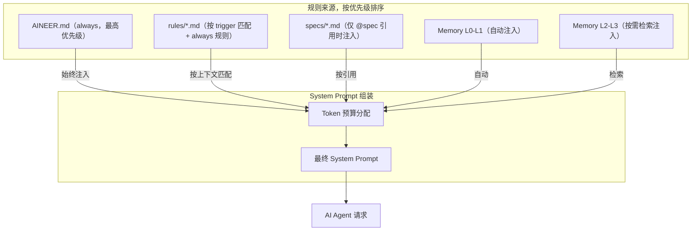

**Token 预算分配（默认）：**

| 来源           | 预算占比          | 说明                  |
| -------------- | ----------------- | --------------------- |
| AINEER.md      | 固定 ~500 tokens  | 项目总览，始终注入    |
| 匹配的 Rules   | 最多 ~1000 tokens | 按优先级截断          |
| @spec 引用     | 按用户选择        | 不计入自动预算        |
| Memory L0-L1   | ~500 tokens       | 身份 + 项目概要       |
| Memory L2-L3   | 按需检索          | 不计入自动预算        |
| **自动总预算** | ~2000 tokens      | 约占上下文窗口的 2-3% |

#### 1.12.3 OpenSpec 支持

**OpenSpec 在 Aineer 中的角色：** 不是嵌入 OpenSpec 到 Aineer，而是 Aineer **原生支持 OpenSpec 作为 `.aineer/specs/` 的文档格式标准**。

**功能集成点：**

1. **`/spec` 命令**：在 SmartInputBar 中输入 `/spec` 可创建/编辑/查看规格文档
2. **`@spec` 引用**：在 AI Chat/Agent 模式中，`@spec:product-design` 可引用特定 spec 作为 AI 上下文
3. **Agent spec 感知**：Agent 执行任务前，自动检查 `.aineer/specs/` 中是否有对应功能的 spec，按 spec 执行
4. **Spec 验证**：Agent 完成任务后，可对照 spec 自我检查（`/spec check`）
5. **Spec 生成**：AI 可从现有代码反向生成 spec 草稿（`/spec generate`）

**Dogfooding：** 本文档（`aineer-product-tech-design.md`）将放入 `.aineer/specs/`，Aineer 开发自身时 Agent 可读取此 spec。

#### 1.12.4 项目级 MCP 配置

**`.aineer/mcp/servers.json` 格式：**

```json
{
  "servers": {
    "mempalace": {
      "type": "stdio",
      "command": "mempalace",
      "args": ["mcp-server", "--palace-dir", ".aineer/memory/palace"],
      "description": "Project memory via MemPalace"
    },
    "database": {
      "type": "stdio",
      "command": "mcp-server-postgres",
      "args": ["--connection-string", "${DB_URL}"],
      "description": "Project database tools"
    }
  }
}
```

**配置层级：** 项目级 `.aineer/mcp/servers.json` 与全局 `~/.aineer/settings.json` 中的 `mcpServers` 合并，项目级覆盖全局级（同名 server）。

**Settings UI 集成：** Settings 面板的"能力"页增加 "MCP Servers" 子页，可可视化管理项目级和全局级的 MCP 配置。

#### 1.12.5 `.aineer/` 初始化流程

```
aineer init
  │
  ├── 创建 .aineer/ 目录
  ├── 生成 AINEER.md（扫描项目：语言、框架、技术栈、README 摘要）
  ├── 生成 settings.json（默认配置）
  ├── 生成 .gitignore（忽略运行时产物）
  ├── 创建 rules/general.md（通用规则模板）
  ├── 创建 specs/（空目录）
  └── 创建 mcp/servers.json（空配置）
```

**智能初始化：** `aineer init` 时 AI 会扫描项目结构，自动生成：

- `AINEER.md`：基于 README、Cargo.toml/package.json 等推断项目概要
- `rules/general.md`：基于检测到的语言/框架生成对应编码规范建议
- 用户可交互式确认或编辑生成内容

---

# 篇二 · UI 设计系统

---

## 2. UI 设计系统规范

### 2.0 设计目标与量化指标

**设计目标：** 建立一套系统性的、可维护的、跨主题一致的视觉语言，让所有界面元素在任何主题下都保持统一的品质感和可用性。

| 维度     | 目标                      | 量化指标                                    |
| -------- | ------------------------- | ------------------------------------------- |
| 性能     | 界面流畅无卡顿            | 首次绘制 <200ms；滚动 60fps；输入延迟 <16ms |
| 一致性   | 组件在暗/亮主题下视觉一致 | 100% 使用语义 token，0 硬编码色值           |
| 信息密度 | 高于 Warp，低于原始终端   | 单屏可见 Block 数 >= 5（默认字号）          |
| 可访问性 | WCAG 2.1 AA               | 文本对比度 >= 4.5:1；大文本 >= 3:1          |
| 可学习性 | VS Code 用户 5 分钟上手   | 核心快捷键与 VS Code 一致率 >= 80%          |
| 可定制性 | 支持用户自定义主题        | 全部 ~200 语义 token 可在 JSON 中覆盖       |

### 2.1 设计令牌（Design Tokens）

设计令牌是 UI 设计系统的原子层。所有组件的色彩、字号、间距、圆角等属性均通过 token 引用，不直接使用硬编码值。

#### 2.1.1 色彩系统（Color System）

**色彩架构：** 三层体系——原始色板 → 语义别名 → 组件映射

```mermaid
graph LR
  subgraph primitives [原始色板]
    Gray["Gray 0-12"]
    Blue["Blue 0-12"]
    Red["Red 0-12"]
    Green["Green 0-12"]
    Yellow["Yellow 0-12"]
    Orange["Orange 0-12"]
    Purple["Purple 0-12"]
  end

  subgraph semantic [语义 Token ~200 个]
    BgBase["background"]
    BgSurface["background.surface"]
    BgElevated["background.elevated"]
    TextPrimary["text.primary"]
    TextMuted["text.muted"]
    AccentAI["accent.ai"]
    AccentAgent["accent.agent"]
    StatusError["status.error"]
    StatusSuccess["status.success"]
  end

  subgraph component [组件映射]
    BlockBg["command_block.bg"]
    AIBlockBg["ai_block.bg"]
    InputBg["input_bar.bg"]
    SidebarBg["sidebar.bg"]
  end

  primitives --> semantic --> component
```

**核心语义 Token 分类：**

| 类别 | Token                 | 暗色默认           | 用途                                 |
| ---- | --------------------- | ------------------ | ------------------------------------ |
| 背景 | `background`          | Gray 12 (#1e1e2e)  | 主区域背景                           |
| 背景 | `background.surface`  | Gray 11 (#232334)  | Block 卡片背景                       |
| 背景 | `background.elevated` | Gray 10 (#2a2a3c)  | 弹窗/Tooltip 背景                    |
| 背景 | `background.input`    | Gray 11 (#232334)  | 输入框背景                           |
| 文本 | `text.primary`        | Gray 1 (#e0e0e8)   | 主文本                               |
| 文本 | `text.secondary`      | Gray 5 (#8888a0)   | 次要文本/提示                        |
| 文本 | `text.muted`          | Gray 7 (#5c5c72)   | 禁用/占位符                          |
| 文本 | `text.on-accent`      | White              | 强调色上的文本                       |
| 强调 | `accent.primary`      | Blue 6 (#5b9cf5)   | 主交互色（链接、焦点环）             |
| 强调 | `accent.ai`           | Purple 6 (#b07aff) | AI 标识色（AI Block 侧标、品牌光晕） |
| 强调 | `accent.agent`        | Orange 6 (#f0a050) | Agent 模式标识色                     |
| 状态 | `status.error`        | Red 6 (#f06060)    | 错误/失败                            |
| 状态 | `status.warning`      | Yellow 6 (#e8c040) | 警告                                 |
| 状态 | `status.success`      | Green 6 (#50c878)  | 成功/通过                            |
| 状态 | `status.info`         | Blue 5 (#70a8e8)   | 信息                                 |
| 边框 | `border.default`      | Gray 9 (#3a3a4e)   | 默认边框                             |
| 边框 | `border.focus`        | Blue 6 (#5b9cf5)   | 焦点边框                             |

**终端 ANSI 色映射：** 终端 16 色和 256 色直接使用 `alacritty_terminal` 标准色板，不走语义 token，确保终端内容色彩与传统终端一致。

#### 2.1.2 字体系统（Typography）

| Token                      | 值                                                                     | 用途                           |
| -------------------------- | ---------------------------------------------------------------------- | ------------------------------ |
| `font.mono`                | "Berkeley Mono", "Cascadia Code", "JetBrains Mono", "Menlo", monospace | 终端内容、代码块、Shell prompt |
| `font.sans`                | "Inter", "SF Pro Text", "Segoe UI", system-ui, sans-serif              | AI 正文、UI chrome、按钮标签   |
| `font.size.xs`             | 11px                                                                   | 辅助标签（时间戳、Badge）      |
| `font.size.sm`             | 12px                                                                   | StatusBar、Tooltip             |
| `font.size.base`           | 13px                                                                   | 默认正文、终端字体             |
| `font.size.md`             | 14px                                                                   | AI 正文、侧栏标题              |
| `font.size.lg`             | 16px                                                                   | Block 标题、Welcome 卡片       |
| `font.size.xl`             | 20px                                                                   | Welcome 标题                   |
| `font.size.2xl`            | 28px                                                                   | Logo 字样                      |
| `font.weight.regular`      | 400                                                                    | 正文                           |
| `font.weight.medium`       | 500                                                                    | 标签、小标题                   |
| `font.weight.semibold`     | 600                                                                    | 标题、活跃 Tab                 |
| `font.line-height.tight`   | 1.3                                                                    | 终端内容                       |
| `font.line-height.normal`  | 1.5                                                                    | AI 正文                        |
| `font.line-height.relaxed` | 1.6                                                                    | Welcome 页面                   |

**排版约定：**

- 终端内容始终用 `font.mono`，不可被主题覆盖
- AI 回复正文用 `font.sans`，代码块内切 `font.mono`
- UI chrome（按钮、菜单、StatusBar）用 `font.sans`

#### 2.1.3 间距系统（Spacing Scale）

基础单位：**4px**。所有间距为 4 的倍数。

| Token      | 值   | 用途                                   |
| ---------- | ---- | -------------------------------------- |
| `space.0`  | 0px  | 无间距                                 |
| `space.1`  | 4px  | 图标与文字间距、Badge 内边距           |
| `space.2`  | 8px  | **Block 间距**、按钮内边距、列表项间距 |
| `space.3`  | 12px | **Block 内边距**、卡片 padding         |
| `space.4`  | 16px | 区域间距、面板 padding                 |
| `space.5`  | 20px | 大区域间距                             |
| `space.6`  | 24px | StatusBar 高度                         |
| `space.8`  | 32px | Welcome 卡片间距                       |
| `space.12` | 48px | **ActivityBar 宽度**                   |

#### 2.1.4 圆角（Border Radius）

| Token         | 值     | 用途               |
| ------------- | ------ | ------------------ |
| `radius.none` | 0px    | 全屏终端           |
| `radius.sm`   | 2px    | Block 卡片、代码块 |
| `radius.md`   | 4px    | 按钮、输入框、芯片 |
| `radius.lg`   | 8px    | 弹窗、模态框       |
| `radius.full` | 9999px | 头像、Badge 圆形   |

**原则：** 极小圆角（2-4px），传达"工具感"而非"消费品感"。

#### 2.1.5 阴影与层级（Elevation）

| Token         | 值                         | 用途              |
| ------------- | -------------------------- | ----------------- |
| `shadow.none` | none                       | 默认平面元素      |
| `shadow.sm`   | 0 1px 3px rgba(0,0,0,0.3)  | Tooltip、下拉菜单 |
| `shadow.md`   | 0 4px 12px rgba(0,0,0,0.4) | 弹窗、命令面板    |
| `shadow.lg`   | 0 8px 24px rgba(0,0,0,0.5) | 模态框、AI 悬浮层 |

**暗色模式中阴影弱化**，主要通过背景色差区分层级。

#### 2.1.6 Z-Index 层级

| Token        | 值  | 用途                       |
| ------------ | --- | -------------------------- |
| `z.base`     | 0   | 正常文档流                 |
| `z.sticky`   | 10  | Tab 栏、StatusBar          |
| `z.dropdown` | 20  | 下拉菜单、@ picker、/ menu |
| `z.overlay`  | 30  | Sidebar overlay（移动端）  |
| `z.modal`    | 40  | 命令面板、审批对话框       |
| `z.toast`    | 50  | Toast 通知                 |
| `z.tooltip`  | 60  | Tooltip（最高层）          |

### 2.2 图标系统（Iconography）

**风格：** 线性图标（Line icons），对齐 [Lucide](https://lucide.dev) 风格

| 属性 | 值                                                                                     |
| ---- | -------------------------------------------------------------------------------------- |
| 尺寸 | 16x16 px（标准），20x20 px（ActivityBar），12x12 px（inline）                          |
| 描边 | 1.5px                                                                                  |
| 圆角 | 与 `radius.sm` 一致                                                                    |
| 颜色 | 使用语义 token（`text.secondary` 默认，`text.primary` hover，`accent.primary` active） |

**ActivityBar 图标清单：**

| 图标         | 功能            | 快捷键      |
| ------------ | --------------- | ----------- |
| FolderTree   | Explorer 文件树 | Cmd+Shift+E |
| Search       | 全局搜索        | Cmd+Shift+F |
| GitBranch    | Git 面板        | Cmd+Shift+G |
| BrainCircuit | Context 上下文  | Cmd+Shift+X |
| BookOpen     | Memory 记忆     | Cmd+Shift+M |
| Settings     | 设置            | Cmd+,       |
| — 底部分隔 — |                 |             |
| UserCircle   | 用户头像/账户   | —           |

### 2.3 布局系统（Layout System）

#### 2.3.1 三栏架构

```
┌────────┬────────────────────────────┬───────────┐
│ 48px   │        flex: 1             │ 240-400px │
│ fixed  │        min: 480px          │ collapsible│
│        │                            │           │
│Activity│     Main Content Area      │  Sidebar  │
│  Bar   │                            │           │
│        │                            │           │
│        ├────────────────────────────┤           │
│        │ SmartInputBar  (flex-none) │           │
│        ├────────────────────────────┼───────────┤
│        │ StatusBar 24px (flex-none)              │
└────────┴─────────────────────────────────────────┘
```

**布局规则：**

- ActivityBar 固定 48px，永不折叠
- Sidebar 默认 280px，拖拽范围 240-400px，Cmd+B 切换显隐
- 主区域最小宽度 480px，当窗口过窄时 Sidebar 自动收起
- StatusBar 跨全宽（含 Sidebar 区域），高度固定 24px
- Tab 栏高度 36px

#### 2.3.2 响应式行为

| 窗口宽度   | Sidebar                  | ActivityBar      | 适配行为            |
| ---------- | ------------------------ | ---------------- | ------------------- |
| >= 1200px  | 显示（可折叠）           | 显示             | 完整三栏            |
| 800-1199px | 隐藏（可展开为 overlay） | 显示             | 双栏 + overlay 侧栏 |
| < 800px    | 隐藏                     | 折叠为 hamburger | 单栏，全屏 Block 流 |

### 2.4 动效系统（Motion System）

#### 2.4.1 动效原则

1. **功能优先** — 每个动效必须服务于信息传达（状态变化、空间关系），不是装饰
2. **不阻塞** — 所有动画期间用户可继续操作
3. **快进快出** — 出现动画稍慢（让用户注意到），消失动画更快（不浪费时间）
4. **可关闭** — "Reduce Motion" 设置关闭所有动画，切换为立即显示

#### 2.4.2 缓动函数

| Token          | CSS 等价                          | 用途                          |
| -------------- | --------------------------------- | ----------------------------- |
| `ease.default` | cubic-bezier(0.2, 0, 0, 1)        | 大多数过渡                    |
| `ease.in`      | cubic-bezier(0.4, 0, 1, 1)        | 退出/消失                     |
| `ease.out`     | cubic-bezier(0, 0, 0.2, 1)        | 进入/出现                     |
| `ease.spring`  | cubic-bezier(0.34, 1.56, 0.64, 1) | 弹性效果（Toast、审批弹窗）   |
| `ease.linear`  | linear                            | 循环动画（光标闪烁、loading） |

#### 2.4.3 完整动效规格

| 动效              | 时长   | 缓动         | 触发场景                    |
| ----------------- | ------ | ------------ | --------------------------- |
| Block 出现        | 200ms  | ease.out     | 新 Block 追加到流底部       |
| Block 折叠/展开   | 150ms  | ease.default | 用户点击折叠按钮            |
| 模式切换          | 200ms  | ease.out     | Shell / AI / Agent 模式变化 |
| Sidebar 展开/折叠 | 200ms  | ease.out     | Cmd+B 或拖拽                |
| Toast 出现        | 300ms  | ease.spring  | 通知触发                    |
| Toast 消失        | 200ms  | ease.in      | 自动消失/用户关闭           |
| AI streaming 光标 | 500ms  | ease.linear  | AI 流式回复中               |
| 错误诊断气泡      | 300ms  | ease.out     | 命令失败后 AI 分析完成      |
| Ghost text 出现   | 100ms  | ease.out     | 补全建议匹配                |
| Agent step 完成   | 200ms  | ease.out     | Agent 步骤状态变更          |
| Agent 审批弹窗    | 250ms  | ease.spring  | 危险操作需确认              |
| 上下文芯片出现    | 150ms  | ease.out     | 添加附件/@引用              |
| 搜索结果高亮      | 100ms  | ease.default | 搜索匹配定位                |
| Welcome logo      | 3000ms | ease.default | 首次启动循环呼吸            |
| 进度条前进        | 200ms  | ease.default | Agent 步骤推进              |
| 分享卡片          | 300ms  | ease.out     | 生成分享截图                |

### 2.5 组件规范（Component Library）

#### 2.5.1 组件状态机

所有交互组件遵循统一的状态模型：

```mermaid
stateDiagram-v2
    [*] --> Default
    Default --> Hover: 鼠标进入
    Hover --> Default: 鼠标离开
    Hover --> Pressed: 鼠标按下
    Pressed --> Hover: 鼠标释放
    Default --> Focused: Tab 聚焦
    Focused --> Default: Blur
    Focused --> Pressed: Enter/Space
    Default --> Disabled: 属性设置
    Default --> Loading: 异步操作中
    Loading --> Default: 操作完成
    Loading --> ErrorState: 操作失败
    ErrorState --> Default: 错误清除
```

**状态视觉映射：**

| 状态     | 背景变化               | 边框变化                | 文本变化       | 其他                      |
| -------- | ---------------------- | ----------------------- | -------------- | ------------------------- |
| Default  | token 默认值           | token 默认值            | token 默认值   | —                         |
| Hover    | 亮度 +5%               | 不变                    | 不变           | cursor: pointer           |
| Pressed  | 亮度 -3%               | 不变                    | 不变           | transform: scale(0.98)    |
| Focused  | 不变                   | `border.focus` 2px ring | 不变           | outline: 2px solid accent |
| Disabled | opacity: 0.5           | 不变                    | `text.muted`   | cursor: not-allowed       |
| Loading  | 不变                   | 不变                    | 不变           | spinner overlay           |
| Error    | `status.error` bg tint | `status.error` border   | `status.error` | shake 动画                |

#### 2.5.2 基础组件

**Button（按钮）**

| 变体      | 背景                  | 用途                     |
| --------- | --------------------- | ------------------------ |
| Primary   | `accent.primary`      | 主操作（Run, Send）      |
| Secondary | `background.elevated` | 次要操作（Copy, Cancel） |
| Ghost     | transparent           | 工具栏按钮、Block 操作   |
| Danger    | `status.error`        | 危险操作确认             |

尺寸：`sm` (24px 高) / `md` (32px 高) / `lg` (40px 高)

**Chip（芯片 / 标签）**

用于上下文芯片区：

- 文件芯片：`📎 filename.rs ✕`（背景 `background.elevated`，圆角 `radius.md`）
- 图片芯片：`🖼 screenshot.png ✕`（含缩略图预览）
- Block 引用芯片：`📦 Block #42 ✕`

**Badge（徽标）**

- 圆形数字徽标（通知计数）：`radius.full`，背景 `accent.primary`
- 状态徽标（dot）：8px 圆点，状态色

**Tooltip**

- 延迟 300ms 出现，离开立即消失
- 背景 `background.elevated`，阴影 `shadow.sm`
- 最大宽度 280px，长文本自动换行

**ScrollArea**

- 滚动条默认隐藏，hover 显示（8px 宽，圆角）
- 滚动条颜色 `text.muted`，hover 时 `text.secondary`

#### 2.5.3 Block 组件视觉规格

所有 Block 共享基础样式：

| 属性 | 值                                                  |
| ---- | --------------------------------------------------- |
| 背景 | `background.surface`                                |
| 圆角 | `radius.sm` (2px)                                   |
| 间距 | Block 间 `space.2` (8px)，Block 内 `space.3` (12px) |
| 边框 | `border.default` 1px（hover 时显示，默认透明）      |

**CommandBlock 视觉层级：**

```
┌─ CommandBlock ──────────────────────────────────┐
│ ❯ cargo build --release              [⏱ 32.4s] │  ← Prompt 行：text.primary，font.mono
│ ┌──────────────────────────────────────────────┐│
│ │ Compiling aineer v0.1.0                      ││  ← 终端区域：独立 bg，ANSI 原色
│ │ error[E0308]: mismatched types               ││
│ └──────────────────────────────────────────────┘│
│ ✗ exit 1 · 🤖 AI 诊断可用 [查看]               │  ← 状态行：text.secondary + status.error
└─────────────────────────────────────────────────┘
```

- Prompt 行背景：比 Block 背景亮 2%（微差）
- 终端输出区域：使用终端自身背景色（通常更暗）
- 状态行：`font.size.xs`，`text.secondary`
- exit_code != 0：Prompt 行左侧显示 `status.error` 竖线（2px）

**AIBlock 视觉层级：**

```
┌─ AIBlock ───────────────────────────────────────┐
│ 🟣 Claude Sonnet                    2 分钟前     │  ← 标识行：accent.ai 圆点
│                                                   │
│ 类型不匹配发生在 `src/main.rs:42`...             │  ← 正文：font.sans，font.size.md
│                                                   │
│ ┌─ bash ────────────────── [▶ Run] [📋 Copy] ──┐│
│ │ sed -i 's/&name/name.to_string()/' ...        ││  ← 代码块：font.mono，bg 更暗
│ └───────────────────────────────────────────────┘│
│ ✓ 完成 · 1.2s · 384 tokens                      │  ← 底部：text.muted
└─────────────────────────────────────────────────┘
```

- 左侧 `accent.ai` 色竖线（2px），区分于 CommandBlock
- AI 正文用 `font.sans`，`line-height.normal`
- 代码块内切 `font.mono`，背景比 Block 背景暗 3%
- 代码块顶部显示语言标签 + 动作按钮（Ghost Button）

**AgentPlanBlock 视觉层级：**

- 左侧 `accent.agent` 色竖线（2px）
- 步骤列表使用 `font.mono` `font.size.sm`
- 当前运行步骤：背景微高亮 + spinner
- 完成步骤：`status.success` 勾选
- 需审批步骤：`accent.agent` 锁图标
- 进度条：`accent.agent` 渐变填充

#### 2.5.4 SmartInputBar 组件规格

**三模式视觉差异：**

| 模式    | 底边线颜色                 | 左侧徽标                   | 右侧工具栏            |
| ------- | -------------------------- | -------------------------- | --------------------- |
| Shell   | `border.default`（无发光） | `[Shell ▾]` text.secondary | `[⌘⏎ AI]` 淡入提示    |
| AI Chat | `accent.ai` 1px 发光       | `[AI ▾]` accent.ai         | 模型选择器 + `[⌘⏎ ▶]` |
| Agent   | `accent.agent` 1px 发光    | `[Agent ▾]` accent.agent   | 审批策略 + `[⌘⏎ ▶]`   |

**输入区域规格：**

- 最小高度：40px（单行）
- 最大高度：8 行（~160px），超出后内部滚动
- 上下文芯片区：位于输入框上方，高度自适应
- Token 预算栏（仅 AI/Agent 模式）：`font.size.xs`，居左
- 模型选择器：Ghost Button + Dropdown

#### 2.5.5 Chrome 组件规格

**ActivityBar：**

- 宽度 48px，背景 `background`（最暗层）
- 图标 20x20，垂直居中，间距 `space.2`
- 活跃项：左侧 2px `accent.primary` 竖线 + 图标色 `text.primary`
- 非活跃项：图标色 `text.muted`

**StatusBar：**

- 高度 24px，背景比主区域暗 1 阶
- 内容分两侧：左侧（Gateway 灯 + Git 分支 + CWD）+ 右侧（模型名 + Token 用量 + 通知）
- 字体 `font.size.xs`，颜色 `text.secondary`

**Tab 栏：**

- 高度 36px
- 活跃 Tab：`font.weight.semibold`，底部 2px `accent.primary` 线
- 非活跃 Tab：`text.secondary`，hover 时 `text.primary`
- `+` 新建 Tab 按钮：Ghost Button

**CommandPalette：**

- 居中浮层，宽度 600px，最大高度 400px
- 背景 `background.elevated`，阴影 `shadow.md`
- 输入框在顶部，结果列表在下方
- 模糊搜索，实时过滤，最近使用优先

**Toast：**

- 右上角堆叠，最大 3 条
- 宽度 360px，背景 `background.elevated`，阴影 `shadow.sm`
- 4 种类型：info / success / warning / error，左侧 4px 状态色竖线
- 默认 4 秒后自动消失，hover 暂停计时

### 2.6 主题架构（Theme Architecture）

#### 2.6.1 Theme CSS Variables 结构

主题通过 CSS variables 定义在 `ui/styles/globals.css` 的 `:root` 中，使用 oklch 色彩空间：

```css
:root {
  --background: oklch(0.15 0.01 260);
  --foreground: oklch(0.93 0.01 260);
  --card: oklch(0.18 0.01 260);
  --primary: oklch(0.65 0.18 260);
  --secondary: oklch(0.22 0.01 260);
  --muted: oklch(0.22 0.01 260);
  --muted-foreground: oklch(0.6 0.01 260);
  --accent: oklch(0.25 0.02 260);
  --destructive: oklch(0.6 0.2 25);
  --border: oklch(0.25 0.01 260);
  --ring: oklch(0.65 0.18 260);
  --sidebar: oklch(0.12 0.01 260);

  /* Aineer 特有语义色 */
  --ai: oklch(0.65 0.15 290); /* AI 回复强调色 */
  --agent: oklch(0.7 0.15 55); /* Agent 模式强调色 */

  /* 间距/圆角 */
  --radius: 0.5rem;
}
```

通过 Tailwind `@theme inline` 映射为工具类：`bg-background`, `text-ai`, `border-border` 等。

#### 2.6.2 内置主题

| 主题                | 基调     | 说明                                         |
| ------------------- | -------- | -------------------------------------------- |
| Aineer Dark（默认） | 冷灰暗色 | 灵感来源 One Dark + Zed 默认，适合长时间工作 |
| Aineer Light        | 暖白亮色 | 高对比度，适合日间/演示                      |

**自定义主题：** 用户可在 `~/.aineer/themes/` 放置 JSON 文件，覆盖任意 token。格式：

```json
{
  "name": "My Theme",
  "appearance": "dark",
  "colors": {
    "background": "#1a1b26",
    "accent.ai": "#bb9af7",
    "accent.agent": "#ff9e64"
  }
}
```

#### 2.6.3 暗色/亮色切换规则

- 亮色主题不是简单反转——需要独立设计（对比度、阴影方向不同）
- 切换时整体过渡 200ms，防止闪烁
- 终端 ANSI 色板随主题切换（暗色用暗色 ANSI，亮色用亮色 ANSI）

### 2.7 交互模式规范（Interaction Patterns）

#### 2.7.1 键盘导航

**全局快捷键（不可冲突）：**

| 快捷键            | 功能            | 作用域       |
| ----------------- | --------------- | ------------ |
| `Cmd+T`           | 新建 Tab        | 全局         |
| `Cmd+W`           | 关闭 Tab        | 全局         |
| `Cmd+1-9`         | 切换 Tab        | 全局         |
| `Cmd+Shift+P`     | 命令面板        | 全局         |
| `Cmd+P`           | Quick Open 文件 | 全局         |
| `Cmd+Shift+F`     | 全局搜索        | 全局         |
| `Cmd+B`           | 切换 Sidebar    | 全局         |
| `Cmd+,`           | 打开设置        | 全局         |
| `Cmd+Enter`       | 发送 AI Chat    | 输入框聚焦时 |
| `Cmd+Shift+Enter` | 发送 Agent      | 输入框聚焦时 |
| `Cmd+Shift+S`     | 截屏附件        | 全局         |
| `Cmd+Shift+A`     | AI 悬浮层       | 全屏终端模式 |
| `Ctrl+C`          | 终端中断        | 终端聚焦时   |
| `Ctrl+L`          | 终端清屏        | 终端聚焦时   |
| `Cmd+K`           | 清除 Block 流   | 主区域聚焦时 |
| `Cmd++` / `Cmd+-` | 字号缩放        | 全局         |
| `Up` / `Down`     | Block 导航      | 主区域聚焦时 |
| `Enter`           | 展开/折叠 Block | Block 聚焦时 |

**焦点管理：** Tab 键在主要区域间循环：InputBar → StreamView → Sidebar → ActivityBar

#### 2.7.2 拖拽交互

| 拖拽源        | 拖拽目标 | 行为                     |
| ------------- | -------- | ------------------------ |
| Block         | InputBar | 添加为 @block 上下文引用 |
| 文件（外部）  | InputBar | 添加为文件附件           |
| 图片（外部）  | InputBar | 添加为图片附件           |
| Explorer 文件 | InputBar | 添加为 @file 引用        |
| Sidebar 边缘  | 左右拖拽 | 调整 Sidebar 宽度        |

#### 2.7.3 右键上下文菜单

| 位置           | 菜单项                                            |
| -------------- | ------------------------------------------------- |
| CommandBlock   | Copy / Rerun / Ask AI / Delete / Share            |
| AIBlock        | Copy / Regenerate / Switch Model / Delete / Share |
| AgentPlanBlock | Terminate / Retry Failed Step / Copy Plan         |
| Explorer 文件  | Open / Open Diff / Copy Path / Delete             |
| 输入框         | Paste / Paste as File / Clear                     |

### 2.8 Block 视觉系统总览

```
Block 间距 8px
        ↓
┌─ CommandBlock ──────────────────────────────────┐
│ 2px 侧色线（无=正常，红=失败，绿=成功）           │
│ ┌─ Prompt 行 ─────────────────────── bg+2% ──┐│
│ │ ❯ cargo build --release          [⏱ 32.4s] ││
│ └─────────────────────────────────────────────┘│
│ ┌─ 终端输出 ──────────────── 独立终端背景 ────┐│
│ │ (alacritty_terminal 渲染，ANSI 原色)        ││
│ └─────────────────────────────────────────────┘│
│ ┌─ 状态行 ─────────── font.size.xs ──────────┐│
│ │ ✗ exit 1 · 🤖 AI 诊断可用 [查看]           ││
│ └─────────────────────────────────────────────┘│
│ ┌─ 诊断气泡（可选）── bg.elevated ───────────┐│
│ │ 🤖 类型不匹配 [查看修复] [忽略]            ││
│ └─────────────────────────────────────────────┘│
└─────────────────────────────────────────────────┘
        ↓ 8px
┌─ AIBlock ─── 侧色线 accent.ai ─────────────────┐
│ ...                                              │
└──────────────────────────────────────────────────┘
        ↓ 8px
┌─ AgentPlanBlock ─── 侧色线 accent.agent ────────┐
│ ...                                              │
└──────────────────────────────────────────────────┘
```

**侧色线系统（Block 类型标识）：**

| Block 类型           | 侧色线颜色             | 宽度 |
| -------------------- | ---------------------- | ---- |
| CommandBlock（成功） | `status.success` 或 无 | 2px  |
| CommandBlock（失败） | `status.error`         | 2px  |
| AIBlock              | `accent.ai`            | 2px  |
| AgentPlanBlock       | `accent.agent`         | 2px  |
| ToolBlock            | `accent.primary`       | 2px  |
| SystemBlock          | `text.muted`           | 1px  |
| DiffBlock            | `status.info`          | 2px  |

### 2.9 可访问性标准（Accessibility）

| 标准        | 要求                 | 实施方式                           |
| ----------- | -------------------- | ---------------------------------- |
| WCAG 2.1 AA | 文本对比度 >= 4.5:1  | 所有 token 对需通过对比度检查      |
| 键盘可达    | 所有功能可纯键盘操作 | 焦点管理 + Tab 序列 + 快捷键       |
| 屏幕阅读器  | Block 内容可朗读     | ARIA labels / roles / live regions |
| 无色依赖    | 颜色信息有替代表达   | 图标 + 文字标签辅助                |
| 高对比度    | 可选高对比度主题     | `Aineer High Contrast` 主题预设    |
| 动效敏感    | Reduce Motion 模式   | 检测系统偏好 + 手动设置            |
| 字号缩放    | Cmd++/- 缩放全局字号 | rem 基准单位跟随缩放               |

---

# 篇三 · 技术架构与实施

> **实现状态快照（与仓库对齐）**
>
> - **CLI REPL**（`--cli`）：完整 Provider、工具、MCP、会话等与 `crates/cli` + `crates/engine` 一致，为能力基准。
> - **桌面 GUI**：Shell/PTY、设置、主题在 `app/` + `ui/`；**AI 对话**通过 `send_ai_message` → `desktop` 模块流式转发 `ai_stream_delta` 事件（含 `kind: text|thinking` 分离）；**Agent** 通过 `start_agent` → `desktop` 模块运行工具回路（`PermissionMode::Allow`，GUI 审批待接），支持 `stop_agent` 取消。两者均使用 `spawn_blocking` + 统一 Block ID。
> - **已合并/未单独成 crate**：主题与 Design Token 在 [`ui/lib/theme.ts`](../../ui/lib/theme.ts) 与 `globals.css`；桌面终端 PTY 在 `app` 内使用 **`portable-pty`**，无独立 `crates/terminal`、无 `crates/theme`。
> - **当前限制**：桌面 AI 对话为 single-turn 无状态（每次重建 session）；multi-turn 持久会话为后续迭代。
> - **规划中**：`tantivy` 跨 Session 全文检索、`crates/channels` 具体适配器实现、`desktop` 模块抽取为独立 crate。详细路线图见仓库根 `README.md` / `README_CN.md`。

---

## 3. 项目结构（Tauri 2 + React 架构）

```
aineer/
├── Cargo.toml                      # workspace root, members: ["crates/*", "app"]
├── RELEASE_CHANNEL                 # "dev" | "nightly" | "preview" | "stable"
├── package.json                    # bun (bundler + runtime) + biome + shadcn/ui + prompt-kit + xterm.js
├── biome.json                      # linter & formatter (Biome v2)
├── tsconfig.json                   # TypeScript, paths: @/* -> ui/*
│
├── scripts/                         # Bun 构建与开发脚本
│   ├── build.ts                     # 前端生产构建 (Tailwind CLI + Bun.build + 生成 index.html + splash)
│   ├── dev.ts                       # 前端开发服务器 (watch + rebuild + serve :1420)
│   └── version-bump.ts             # 统一版本管理 (package.json + Cargo.toml + tauri.conf.json)
│
├── app/                            # Tauri 2 Rust 后端 (原 src-tauri/)
│   ├── Cargo.toml                  # name: aineer, deps: tauri 2 + workspace crates
│   ├── build.rs                    # tauri-build
│   ├── tauri.conf.json             # Tauri 配置
│   ├── capabilities/               # Tauri 权限
│   ├── icons/                      # 应用图标 (icns/ico/png)
│   └── src/
│       ├── main.rs                 # Tauri 入口 (支持 --cli 切换 CLI 模式)
│       ├── lib.rs                  # Tauri Builder + command 注册
│       ├── blocks/                 # Block 数据模型 (从原 crates/ui 迁入)
│       │   └── mod.rs
│       ├── session.rs              # Session 持久化 (从原 crates/app 迁入)
│       └── commands/               # Tauri IPC commands
│           ├── mod.rs
│           ├── shell.rs            # spawn_pty, write_pty, resize_pty, kill_pty
│           ├── ai.rs               # send_ai_message, stop_ai_stream
│           ├── agent.rs            # start_agent, approve_tool, deny_tool, stop_agent
│           ├── settings.rs         # get/update_settings, get/set_api_key
│           ├── files.rs            # list_dir, read_file, search_files
│           ├── git.rs              # git_status, git_branch
│           ├── memory.rs           # search_memory, remember, forget
│           ├── session.rs          # save/load/list_sessions
│           └── slash_commands.rs   # get/execute_slash_command
│
├── ui/                             # React 前端 (原 src/)
│   ├── main.tsx                    # React 入口
│   ├── App.tsx                     # AppShell 三栏布局 + IPC 对接
│   ├── styles/
│   │   └── globals.css             # Tailwind 4 + CSS variables (shadcn/ui theming)
│   ├── lib/
│   │   ├── utils.ts                # cn() 等工具函数
│   │   ├── theme.ts                # 主题 / design token 与系统偏好
│   │   ├── types.ts                # ChatMessage / SlashCommand / InputMode 等类型定义
│   │   └── tauri.ts                # Tauri IPC 封装层 (invoke wrapper + graceful fallback)
│   └── components/
│       ├── ActivityBar.tsx          # 左侧活动栏
│       ├── Sidebar.tsx              # 右侧面板 (Explorer/Search/Git/Context/Memory/Settings)
│       ├── ChatView.tsx             # 聊天消息流 (shadcn/prompt-kit Message/Tool/Steps/Reasoning)
│       ├── InputBar.tsx             # 三模式输入 (Shell/AI/Agent) + /命令 + @mentions
│       ├── StatusBar.tsx            # 底部状态栏
│       └── ui/                      # shadcn/ui + prompt-kit 基础组件 (本地化副本，可定制)
│           ├── avatar.tsx, badge.tsx, button.tsx, card.tsx, ...
│           ├── chat-container.tsx   # 聊天滚动容器
│           ├── message.tsx          # 消息气泡
│           ├── prompt-input.tsx     # 输入框
│           ├── tool.tsx             # 工具调用展示
│           ├── steps.tsx            # Agent 步骤展示
│           ├── reasoning.tsx        # AI 思考过程
│           ├── loader.tsx           # 加载动画
│           ├── markdown.tsx         # Markdown 渲染
│           └── code-block.tsx       # 代码高亮
│
├── public/                          # 静态资源 (Logo SVG 等，构建时复制到 dist/)
│   ├── logo-dark.svg
│   ├── logo-light.svg
│   ├── logo-horizontal-dark.svg
│   ├── logo-horizontal-light.svg
│   ├── logo-vertical-dark.svg
│   └── logo-vertical-light.svg
│
├── crates/                          # Rust workspace crates (纯业务逻辑)
│   ├── protocol/                    # 共享类型、事件、凭证
│   ├── api/                         # Provider HTTP 客户端
│   ├── engine/                      # Agent 引擎
│   ├── tools/                       # AI 可调用工具
│   ├── gateway/                     # 嵌入式 OpenAI 兼容代理
│   ├── mcp/                         # MCP 客户端
│   ├── lsp/                         # LSP 客户端
│   ├── plugins/                     # 插件系统
│   ├── cli/                         # TUI REPL + desktop 桥接模块 (桌面 GUI 复用 Provider 流式 + 工具栈)
│   ├── provider/                    # Provider 注册表
│   ├── settings/                    # 统一设置系统
│   ├── memory/                      # 记忆系统
│   ├── channels/                    # 多渠道触达
│   ├── auto_update/                 # 自动更新
│   └── release_channel/             # Release channel
│
├── docs/                            # 文档
│   ├── design/                      # 产品与技术设计文档
│   └── images/                      # README 引用图片
└── .github/workflows/               # CI/CD (ci.yml, release.yml, release_nightly.yml)
```

---

## 4. 代码分类：回收 vs 新写 vs 丢弃

### 直接回收（9 个框架无关 crate）

从 `../aineer-legacy/crates/` 复制，**原封不动**或仅做必要调整：

- **`protocol`** — 共享类型、事件、凭证。**调整**：删除 `SettingsDraft` 相关类型（移到新 `settings` crate）
- **`api`** — Provider HTTP 客户端。**调整**：`ProviderClient` 改为调用新 `provider` crate 的 `ProviderRegistry`
- **`engine`** — Agent 引擎。**调整**：config loader 适配新 `settings` crate 的 `SettingsStore`
- **`tools`** — 工具执行。原封不动
- **`gateway`** — 嵌入式代理。原封不动
- **`mcp`** — MCP 客户端。原封不动
- **`lsp`** — LSP 客户端。原封不动
- **`plugins`** — 插件系统。原封不动
- **`cli`** — TUI REPL。**调整**：model 选择改用新 `provider` crate

### 全新编写

| 新 Crate / 模块                           | 主要营养来源                               | 核心差异                                                                                |
| ----------------------------------------- | ------------------------------------------ | --------------------------------------------------------------------------------------- |
| **`provider`**                            | Zed `language_model/` + `language_models/` | 纯 Rust struct；对接 Aineer 的 `api` crate                                              |
| **`settings`**                            | Zed `settings/` + `settings_content/`      | 简化为 3 层（user/project/local）；深度合并不覆盖未知 key                               |
| **`theme`**                               | Zed `theme/`                               | CSS variables 映射；暗/亮两预设 + 自定义 JSON                                           |
| **`terminal`**                            | 旧 Aineer `terminal/`                      | 纯 `alacritty_terminal` + 框架无关 `TerminalContent` 快照                               |
| **`app/`** (Tauri)                        | Tauri 2 脚手架                             | Tauri IPC commands 桥接所有 workspace crates；Rust 侧无 UI 代码                         |
| **`ui/`** (React)                         | shadcn/ui + Prompt Kit + xterm.js          | React 组件：AppShell/ChatView/InputBar + shadcn/prompt-kit 消息组件；CSS variables 主题 |
| **`memory`**                              | 参考 Cursor Rules / Windsurf Memories      | 项目知识 + 个人偏好 + 决策日志；JSON Lines 存储                                         |
| **`channels`**                            | 无（全新）                                 | 飞书/微信/WhatsApp bot 适配层                                                           |
| **`auto_update`** + **`release_channel`** | Zed 同名 crate                             | 替换 URL/channel/bundle ID                                                              |

### 已清理

- ~~GPUI 桌面应用~~ (workspace.rs/application.rs/platform.rs/gui_runtime.rs/bridge.rs) → 已删除，替换为 Tauri 2 + React
- ~~`crates/ui/` GPUI 组件~~ → 已完全删除。Block 等数据模型迁入 `app/src/blocks/`，session 持久化迁入 `app/src/session.rs`；UI 组件在 `ui/` (React + shadcn/prompt-kit) 中实现
- ~~`crates/app/` CLI 入口~~ → 已删除。有用逻辑（session）迁入 `app/src/`，CLI 功能保留在 `crates/cli/`
- ~~`vite.config.ts` + `index.html`~~ → 已删除。前端构建改用 Bun 自定义脚本 (`scripts/build.ts`)
- ~~`ui/assets/`~~ → Logo 文件移至 `public/`；README 图片移至 `docs/images/`

---

## 5. 从 Zed 借鉴的模块清单

以下为从 Zed 借鉴的设计理念（已适配为 Tauri + React 架构）。

| Aineer 新模块       | Zed 源文件                                                                                           | 借鉴内容                                        | 适配要点                                          |
| ------------------- | ---------------------------------------------------------------------------------------------------- | ----------------------------------------------- | ------------------------------------------------- |
| **Provider 注册表** | `crates/language_model/src/registry.rs`                                                              | `LanguageModelRegistry` + `SelectedModel` 寻址  | 去掉 Zed Cloud / Extension；纯 Rust struct        |
| **Provider 实现**   | `crates/language_models/src/provider/{open_ai,anthropic,ollama,google,deepseek,mistral,lmstudio}.rs` | 配置结构 + 认证 + 可用模型列表                  | 对接 Aineer `api::ProviderClient`                 |
| **凭证管理**        | `crates/credentials_provider/` + `language_model/src/api_key.rs`                                     | Env + 系统钥匙串 + ApiKeyState                  | 替换旧 Aineer env-only 方案                       |
| **Provider 设置**   | `crates/settings_content/src/language_model.rs`                                                      | `AllLanguageModelSettingsContent`               | 适配为 Aineer `settings.json` 的 `providers` 字段 |
| **SettingsStore**   | `crates/settings/src/settings_store.rs`                                                              | JSON 深度合并 + 文件监听                        | 简化为 3 层；修复旧 Aineer 全文件覆盖问题         |
| **Agent 设置**      | `crates/agent_settings/src/`                                                                         | model selection 持久化                          | 适配 Aineer AI 设置页                             |
| **Settings UI**     | `crates/settings_ui/src/`                                                                            | `SettingsWindow` 分页 + `SettingField` 控件绑定 | React 组件实现；8 页设置面板                      |
| **Theme**           | `crates/theme/src/` (colors.rs, styles.rs)                                                           | ThemeColors (~200 语义 token)                   | CSS variables 映射；oklch 色彩空间                |
| **终端渲染**        | `crates/terminal_view/src/terminal_element.rs`                                                       | `layout_grid` + `paint` + cursor                | xterm.js + WebGL addon 替代                       |
| **终端后端**        | `crates/terminal/src/terminal.rs`                                                                    | Terminal struct + TerminalContent 快照          | 参考设计；纯 Rust 无 UI 依赖                      |
| **键盘映射**        | `crates/terminal/src/mappings/keys.rs`                                                               | Keystroke → alacritty 字节映射                  | xterm.js 原生键盘处理                             |
| **文件树**          | `crates/project_panel/src/project_panel.rs`                                                          | `render_entry` + `uniform_list`                 | 去掉 Workspace/Editor；用 `fs` + `git2`           |
| **Git 状态**        | `crates/git/src/status.rs`                                                                           | `FileStatus` + 颜色映射                         | 对接 `git2`                                       |
| **Diff 视图**       | `crates/git_ui/src/file_diff_view.rs`                                                                | diff hunk 渲染                                  | 4 模式：unified/side-by-side/new/old              |
| **Command Palette** | `crates/command_palette/`                                                                            | fuzzy match + Action 列表                       | React 组件 + Tauri IPC 实现                       |
| **打包脚本**        | `script/bundle-{mac,linux,windows.ps1}`                                                              | 完整打包流程                                    | 替换 bundle ID/名称/图标                          |
| **自动更新**        | `crates/auto_update/`                                                                                | HTTP 轮询 + 下载安装                            | 替换 URL/channel                                  |
| **Release Channel** | `crates/release_channel/`                                                                            | `include_str!` + channel 枚举                   | 直接复用                                          |

---

## 6. Provider 系统（核心重构，从 Zed 借鉴）

### 6.1 旧 Aineer 的问题

- `app/agent.rs` 总是调用 `auto_detect_default_model()`，**完全忽略** UI 设置
- 只有 3 个内置 Provider（Anthropic/OpenAI/xAI），用字符串前缀检测模型归属
- API Key 只能通过环境变量设置，无 GUI 管理
- `SettingsDraft` 保存时覆盖整个 `settings.json`，丢失 engine 配置

### 6.2 新 Provider 架构

```rust
// crates/provider/src/lib.rs

pub struct ProviderRegistry {
    providers: BTreeMap<ProviderId, Box<dyn Provider>>,
}

pub struct SelectedModel {
    pub provider: ProviderId,   // "anthropic", "openai", "ollama", ...
    pub model: ModelId,         // "claude-sonnet-4-20250514", "gpt-4o", ...
}

impl FromStr for SelectedModel {
    // 解析 "anthropic/claude-sonnet-4-20250514" 格式
}

pub trait Provider: Send + Sync {
    fn id(&self) -> ProviderId;
    fn display_name(&self) -> &str;
    fn available_models(&self) -> Vec<ModelInfo>;
    fn is_authenticated(&self) -> bool;
    fn authenticate(&self, credential: Credential) -> Result<()>;
    fn create_client(&self, model: &ModelId) -> Result<Box<dyn ModelClient>>;
}
```

### 6.3 凭证管理

```rust
// crates/provider/src/credentials.rs

pub enum Credential {
    ApiKey(String),
    EnvVar(String),
    SystemKeychain(String),     // macOS Keychain / Windows Credential Manager
    OAuth(OAuthToken),
}

pub struct CredentialsManager {
    // 优先级：EnvVar > SystemKeychain > OAuth > 手动输入
}
```

### 6.4 内置 Provider 列表

- **Anthropic** — Claude 系列，保留 OAuth
- **OpenAI** — GPT 系列
- **Google (Gemini)** — **新增**，从 Zed 借鉴
- **Ollama** — **升级为一等 provider**，自动发现本地模型
- **OpenRouter** — **升级**
- **DeepSeek** — **新增**
- **Mistral** — **新增**
- **xAI** — Grok 系列
- **LM Studio** — **新增**
- **OpenAI Compatible** — 自定义 endpoint

### 6.5 对 api crate 的影响

旧 `api::ProviderClient` 的 `from_model()` 方法改为委托给 `ProviderRegistry`：

```rust
// crates/api/ 调整
impl ProviderClient {
    pub fn from_registry(
        registry: &ProviderRegistry,
        model: &SelectedModel,
    ) -> Result<Self> {
        let provider = registry.get(&model.provider)?;
        provider.create_client(&model.model)
    }
}
```

---

## 7. Settings 系统（核心重构，从 Zed 借鉴）

### 7.1 完整 settings.json Schema

与 `settings.example.json` 完全对齐，涵盖所有 engine 已支持的配置项：

```rust
// crates/settings/src/schema.rs

#[derive(Debug, Clone, Default, Serialize, Deserialize)]
#[serde(rename_all = "camelCase")]
pub struct SettingsContent {
    // ─── General ───
    pub theme: Option<String>,
    pub font_size: Option<f32>,
    pub language: Option<String>,
    pub session_restore: Option<bool>,

    // ─── Terminal ───
    pub terminal: Option<TerminalSettings>,

    // ─── AI / Models ───
    pub model: Option<String>,                              // "sonnet" / "anthropic/claude-sonnet-4-6"
    pub model_aliases: Option<BTreeMap<String, String>>,    // { "sonnet": "claude-sonnet-4-6", ... }
    pub fallback_models: Option<Vec<String>>,               // ["ollama/qwen3-coder", ...]
    pub thinking_mode: Option<bool>,

    // ─── Providers（自定义 OpenAI 兼容） ───
    pub providers: Option<BTreeMap<String, CustomProviderConfig>>,

    // ─── Gateway ───
    pub gateway: Option<GatewaySettings>,

    // ─── Env（注入到子进程 + Provider 认证） ───
    pub env: Option<BTreeMap<String, String>>,

    // ─── OAuth ───
    pub oauth: Option<OAuthConfig>,

    // ─── Credentials ───
    pub credentials: Option<CredentialConfig>,

    // ─── Permissions ───
    pub permission_mode: Option<String>,                    // "ask" | "auto-edit" | "workspace-write" | "full-auto"
    pub permissions: Option<PermissionsConfig>,

    // ─── MCP Servers ───
    pub mcp_servers: Option<BTreeMap<String, McpServerConfig>>,

    // ─── AI Rules ───
    pub rules: Option<RulesConfig>,

    // ─── Hooks ───
    pub hooks: Option<HooksConfig>,

    // ─── Plugins ───
    pub plugins: Option<PluginsConfig>,
    pub enabled_plugins: Option<BTreeMap<String, bool>>,

    // ─── Sandbox ───
    pub sandbox: Option<SandboxConfig>,

    // ─── Advanced ───
    pub auto_compact: Option<bool>,
    pub max_context_tokens: Option<u32>,

    // ─── 保留未识别的字段（前向兼容） ───
    #[serde(flatten)]
    pub extra: BTreeMap<String, serde_json::Value>,
}

#[derive(Debug, Clone, Serialize, Deserialize)]
#[serde(rename_all = "camelCase")]
pub struct CustomProviderConfig {
    pub base_url: String,
    pub api_version: Option<String>,
    pub api_key: Option<String>,
    pub api_key_env: Option<String>,
    pub models: Vec<String>,
    pub default_model: Option<String>,
    pub headers: Option<BTreeMap<String, String>>,
}

#[derive(Debug, Clone, Serialize, Deserialize)]
#[serde(rename_all = "camelCase")]
pub struct GatewaySettings {
    pub enabled: Option<bool>,              // default: true
    pub listen_addr: Option<String>,        // default: "127.0.0.1:8090"
    pub default_model: Option<String>,
}

#[derive(Debug, Clone, Serialize, Deserialize)]
#[serde(rename_all = "camelCase")]
pub struct TerminalSettings {
    pub shell_path: Option<String>,
    pub shell_args: Option<Vec<String>>,
    pub env: Option<BTreeMap<String, String>>,
    pub font_family: Option<String>,
    pub font_size: Option<f32>,
    pub cursor_shape: Option<String>,       // "block" | "bar" | "underline"
    pub scrollback_lines: Option<u32>,
}

#[derive(Debug, Clone, Serialize, Deserialize)]
#[serde(tag = "type", rename_all = "camelCase")]
pub enum McpServerConfig {
    Stdio { command: String, args: Option<Vec<String>>, env: Option<BTreeMap<String, String>> },
    Sse { url: String, headers: Option<BTreeMap<String, String>>, oauth: Option<McpOAuthConfig> },
    Http { url: String, headers: Option<BTreeMap<String, String>> },
    Ws { url: String, headers: Option<BTreeMap<String, String>> },
    Sdk { name: String },
}

#[derive(Debug, Clone, Serialize, Deserialize)]
#[serde(rename_all = "camelCase")]
pub struct SandboxConfig {
    pub enabled: Option<bool>,
    pub namespace_restrictions: Option<bool>,
    pub network_isolation: Option<bool>,
    pub filesystem_mode: Option<String>,    // "workspace-only" | "full"
    pub allowed_mounts: Option<Vec<String>>,
}

#[derive(Debug, Clone, Serialize, Deserialize)]
#[serde(rename_all = "camelCase")]
pub struct HooksConfig {
    pub pre_tool_use: Option<Vec<String>>,
    pub post_tool_use: Option<Vec<String>>,
}

#[derive(Debug, Clone, Serialize, Deserialize)]
#[serde(rename_all = "camelCase")]
pub struct OAuthConfig {
    pub client_id: String,
    pub authorize_url: String,
    pub token_url: String,
    pub callback_port: Option<u16>,
    pub manual_redirect_url: Option<String>,
    pub scopes: Option<Vec<String>>,
}

#[derive(Debug, Clone, Serialize, Deserialize)]
#[serde(rename_all = "camelCase")]
pub struct CredentialConfig {
    pub default_source: Option<String>,     // "aineer-oauth" | "env" | "keychain"
    pub auto_discover: Option<bool>,
    pub claude_code: Option<ClaudeCodeConfig>,
}

#[derive(Debug, Clone, Serialize, Deserialize)]
#[serde(rename_all = "camelCase")]
pub struct RulesConfig {
    pub auto_inject_budget: Option<u32>,         // auto-injection token budget, default 2000
    pub rules_dir: Option<String>,               // override rules dir, default ".aineer/rules"
    pub specs_dir: Option<String>,               // override specs dir, default ".aineer/specs"
    pub disable_auto_inject: Option<bool>,       // disable all auto rule injection
    pub disabled_rules: Option<Vec<String>>,     // explicitly disabled rule files
}
```

### 7.2 深度合并（修复致命问题）

```rust
// crates/settings/src/lib.rs

pub struct SettingsStore {
    user: SettingsContent,      // ~/.aineer/settings.json
    project: SettingsContent,   // .aineer/settings.json
    local: SettingsContent,     // .aineer/settings.local.json
    merged: SettingsContent,    // 运行时合并结果
}

impl SettingsStore {
    pub fn save_user(&self, updates: &PartialSettings) -> Result<()> {
        let path = user_settings_path();
        let mut existing = read_json_preserving(&path)?;
        deep_merge(&mut existing, &serde_json::to_value(updates)?);
        write_json_pretty(&path, &existing)
    }

    pub fn merged(&self) -> &SettingsContent { &self.merged }

    pub fn resolve_model(&self, registry: &ProviderRegistry) -> Result<SelectedModel> {
        let raw = self.merged.model.as_deref().unwrap_or("auto");
        // 1. 先查 modelAliases
        let resolved = self.merged.model_aliases
            .as_ref()
            .and_then(|aliases| aliases.get(raw))
            .map(|s| s.as_str())
            .unwrap_or(raw);
        // 2. "auto" → registry.auto_detect
        if resolved == "auto" {
            return registry.auto_detect_default();
        }
        // 3. 解析 "provider/model" 或纯 model name
        resolved.parse::<SelectedModel>()
    }
}
```

### 7.3 Agent 真正读取配置

```rust
// crates/app/src/agent.rs

async fn handle_chat(
    settings: &SettingsStore,
    registry: &ProviderRegistry,
    prompt: &str,
    context: &[String],
    tx: &mpsc::Sender<AgentEvent>,
    approval_rx: &mut tokio_mpsc::Receiver<ToolApproval>,
) {
    let selected = match settings.resolve_model(registry) {
        Ok(m) => m,
        Err(e) => { tx.send(AgentEvent::Error(e.to_string())).ok(); return; }
    };

    let client = match registry.create_client(&selected) {
        Ok(c) => c,
        Err(e) => { tx.send(AgentEvent::Error(e.to_string())).ok(); return; }
    };

    let request = MessageRequest {
        model: selected.to_string(),
        thinking: settings.merged().thinking_mode.unwrap_or(false).then_some(ThinkingConfig::default()),
        // ...
    };

    // Stream + tool loop (MAX_TOOL_ITERATIONS = 20)
    // Fallback: on error, try fallback_models in order
    let fallbacks = settings.merged().fallback_models.as_deref().unwrap_or(&[]);
    // ...
}
```

### 7.4 Settings UI（按用户意图组织，非按 crate 分）

**设计原则：** 不按技术模块分页（不存在"Gateway 页"、"MCP 页"），而按用户心智模型分区。一个 Provider 无论被桌面 AI、飞书机器人还是 Gateway 使用，只在一个地方配置一次。

**侧边导航结构：**

```
┌─ Settings ────────────────────────────────────────────┐
│                                                       │
│  ◉ 外观           │                                   │
│  ○ 模型与智能      │  (右侧：当前选中页面的内容)         │
│  ○ 能力            │                                   │
│  ○ 渠道            │                                   │
│  ○ 终端            │                                   │
│  ○ 记忆            │                                   │
│  ○ 安全            │                                   │
│  ○ JSON           │                                   │
│                                                       │
└───────────────────────────────────────────────────────┘
```

---

**A. 外观（Appearance）**

- 主题：One Dark / One Light / System（实时预览）
- UI 字体族 + 字号（Slider 10-24）
- 语言：简体中文 / English
- Session 恢复：Toggle

---

**B. 模型与智能（Models & Intelligence）**— 核心页，最复杂

所有 Provider 统一管理。无论桌面 AI、Gateway、飞书机器人，都使用这同一套 Provider。

```
┌─ 模型与智能 ──────────────────────────────────────────┐
│                                                       │
│  默认模型                                              │
│  ┌─────────────────────────────────────────────┐      │
│  │ [Anthropic ▾]  [claude-sonnet-4-6 ▾]       │      │
│  └─────────────────────────────────────────────┘      │
│  别名：sonnet → claude-sonnet-4-6  [管理别名]          │
│                                                       │
│  Fallback 模型链                                       │
│  1. ollama/qwen3-coder                    [✕]         │
│  2. groq/llama-3.3-70b-versatile          [✕]         │
│  [+ 添加]                                              │
│                                                       │
│  Thinking Mode: [● 开启]                               │
│  上下文长度: [200000] tokens                            │
│                                                       │
│  ─── 内置 Providers ─────────────────────────────      │
│                                                       │
│  🟢 Anthropic     ****ant-xxx          [更换 Key]      │
│  🟢 OpenAI        ****-xxx             [更换 Key]      │
│  ⚪ Google         [设置 API Key]                       │
│  🟢 xAI           ****-xxx             [更换 Key]      │
│  🟢 Ollama        localhost:11434      [在线·3 模型]    │
│  ⚪ DeepSeek       [设置 API Key]                       │
│  ⚪ Mistral        [设置 API Key]                       │
│  🟢 LM Studio     localhost:1234      [在线·1 模型]    │
│                                                       │
│  ─── 自定义 Providers ───────────────────────────      │
│  openclaw-zero  127.0.0.1:3001   9 模型    [编辑]     │
│  groq           api.groq.com     2 模型    [编辑]     │
│  dashscope      dashscope.ali... 2 模型    [编辑]     │
│  [+ 添加自定义 Provider]                                │
│                                                       │
└───────────────────────────────────────────────────────┘
```

自定义 Provider 编辑弹窗字段：

- Provider ID（唯一标识）
- Base URL
- API Key（PasswordInput → 存储方式：环境变量名 / 钥匙串 / 直接写入）
- 自定义 Headers（动态行列表）
- 可用模型列表 + 默认模型
- API Version（可选，Azure 用）

---

**C. 能力（Capabilities）** — Tools + Skills + MCP + Plugins 有机融合

不按技术实现分组，而按"AI 能做什么"统一展示：

```
┌─ 能力 ────────────────────────────────────────────────┐
│                                                       │
│  ─── 内置工具 ──────────────────────────────           │
│  ✅ 文件读写    ✅ Shell 执行    ✅ 代码搜索            │
│  ✅ Git 操作    ✅ 浏览器       ⬜ 网络请求（需审批）    │
│                                                       │
│  ─── MCP 服务器（外部能力扩展）─────────────────       │
│  🟢 filesystem   (stdio) npx @mcp/server-fs   [编辑]  │
│  🟢 database     (sse)   https://mcp.ex.com   [编辑]  │
│  ⚪ my-http      (http)  https://mcp.ex.com   [编辑]  │
│  [+ 添加 MCP Server]                                   │
│                                                       │
│  ─── Skills（提示词模板 / 工作流）───────────           │
│  📋 Code Review    "审查代码并给出改进建议"    [编辑]   │
│  📋 Debug Helper   "分析错误日志并定位原因"    [编辑]   │
│  📋 Commit Writer  "根据 diff 生成 commit msg" [编辑]  │
│  [+ 新建 Skill]                                        │
│                                                       │
│  ─── 插件 ──────────────────────────────────           │
│  ✅ my-plugin-a                              [设置]    │
│  ⬜ my-plugin-b                              [设置]    │
│  外部插件目录: /path/to/custom/plugins       [浏览]    │
│                                                       │
│  ─── Hooks ─────────────────────────────────           │
│  工具调用前: my-pre-hook-plugin              [编辑]    │
│  工具调用后: my-post-hook-plugin             [编辑]    │
│                                                       │
└───────────────────────────────────────────────────────┘
```

MCP Server 编辑支持 5 种类型：Stdio / SSE / HTTP / WebSocket / SDK

**MCP 配置层级：**

- **全局级：** `~/.aineer/settings.json` → `mcpServers`（所有项目可用）
- **项目级：** `.aineer/mcp/servers.json`（仅当前项目，优先于全局同名配置）
- UI 用 Badge 区分来源（`全局` / `项目`），项目级配置旁显示覆盖标记

**AI Rules 管理（集成在"能力"页底部）：**

```
│  ─── AI 行为规则（.aineer/rules/）────────────────   │
│  📜 general.md     always=true       p=10   [编辑]   │
│  📜 rust.md        trigger=*.rs      p=50   [编辑]   │
│  📜 commit.md      trigger=commit    p=50   [编辑]   │
│  [+ 新建规则]                                         │
│                                                       │
│  自动注入 Token 预算: [2000] tokens                    │
│  [● 启用自动注入]                                      │
```

---

**D. 渠道（Channels）** — 所有触达 AI 大脑的入口

```
┌─ 渠道 ────────────────────────────────────────────────┐
│                                                       │
│  所有渠道共享同一个 AI 大脑（模型、记忆、能力）         │
│                                                       │
│  ─── 桌面应用 ──────────────────────────────           │
│  🟢 始终启用 (Shell + Chat 统一界面)                    │
│                                                       │
│  ─── HTTP API (Gateway) ─────────────────────          │
│  [● 启用]    监听: [127.0.0.1:8090]                    │
│  🟢 Running · OpenAI 兼容 · /v1/chat/completions      │
│  默认模型: [sonnet ▾]                                   │
│  用法: curl http://127.0.0.1:8090/v1/... [📋 Copy]    │
│  💡 Cursor / Continue.dev 可指向此地址                  │
│                                                       │
│  ─── 飞书机器人 ─────────────────────────────          │
│  [⚪ 未启用]  [配置飞书 App]                             │
│  App ID: [                    ]                        │
│  App Secret: [••••••••        ]                        │
│  Event URL: https://your-server/feishu/webhook         │
│  消息转发: [● 所有 @提及] / [○ 仅指定群组]              │
│                                                       │
│  ─── 微信机器人 ─────────────────────────────          │
│  [⚪ 未启用]  [配置微信开放平台]                          │
│  ...                                                   │
│                                                       │
│  ─── WhatsApp ───────────────────────────────          │
│  [⚪ 未启用]  [配置 Meta Business API]                   │
│  ...                                                   │
│                                                       │
└───────────────────────────────────────────────────────┘
```

---

**E. 终端（Terminal）**

- Shell 路径 + "自动检测" 按钮
- Shell 参数
- 环境变量（动态行列表）
- 终端字体（FontPicker，等宽字体）+ 字号
- 光标样式（Block / Bar / Underline）
- 回滚行数（默认 10000）

---

**F. 记忆与知识（Memory & Knowledge）**

```
┌─ 记忆与知识 ──────────────────────────────────────────┐
│                                                       │
│  ─── 记忆宫殿状态 ─────────────────────────            │
│  🟢 MemPalace MCP Server: Running                     │
│  Wings: 3 · Rooms: 47 · Facts: 238                    │
│                                                       │
│  ─── 项目记忆（Wing: my-rust-project）──────           │
│  📁 项目: ~/my-project                                 │
│  已识别: Rust + Cargo + PostgreSQL + Docker             │
│  项目规则: .aineer/rules/ (3 files)  [管理规则]          │
│  已积累 23 条项目知识  [浏览宫殿]                       │
│                                                       │
│  ─── 个人偏好（Wing: User Preferences）─────           │
│  "偏好 dark 主题" · "简洁 commit message"              │
│  "常用 cargo test --release" · 共 12 条                 │
│  [查看全部]  [清除偏好]                                 │
│                                                       │
│  ─── 决策日志 ─────────────────────────────            │
│  2026-04-08: "选择 GPUI 因为更接近 Zed 生态"           │
│  2026-04-05: "用 alacritty_terminal 因为 Zed 验证过"   │
│  共 8 条  [查看全部]                                    │
│                                                       │
│  ─── 知识库（Knowledge Base）─────────────              │
│  📚 GPUI Docs     ~/docs/gpui/       142 文件  [🟢]   │
│  📚 API Reference ~/docs/api-ref/     38 文件  [🟢]   │
│  [+ 添加知识库目录]                                     │
│  监听文件变更: [● 开启]（新文件自动索引）                │
│                                                       │
│  ─── 设置 ─────────────────────────────────            │
│  MemPalace 后端: [内置 MCP ▾] / [外部 MCP URL]         │
│  自动记忆: [● 开启]                                     │
│  渐进加载 Token 预算: L1=[2000] L2=[3000]              │
│  记忆保留天数: [90] 天                                  │
│  [导出记忆]  [清除全部记忆]                              │
│                                                       │
└───────────────────────────────────────────────────────┘
```

---

**G. 安全（Safety & Permissions）**

- 默认权限模式：ask / auto-edit / workspace-write / full-auto
- 规则列表（Pattern glob + 动作 allow/deny/ask）
- Sandbox：Toggle + 子选项（命名空间隔离 / 网络隔离 / 文件系统模式）
- OAuth 配置（Aineer 平台认证）
- 凭证来源优先级（aineer-oauth / env / keychain / claude-code discovery）

---

**H. JSON（原始编辑器）**

- 完整 settings.json 语法高亮编辑
- 实时 JSON 校验 + 错误标记
- 保存时深度合并（不丢失任何 key）

---

## 8. 记忆与知识系统（Memory + Knowledge Base）

借鉴 **MemPalace**（GitHub: milla-jovovich/mempalace, 36.9k stars, LongMemEval 召回率 96.6%）的层级记忆架构，而非简单的向量数据库或 JSON 平铺。

### 8.1 记忆宫殿架构（借鉴 MemPalace）

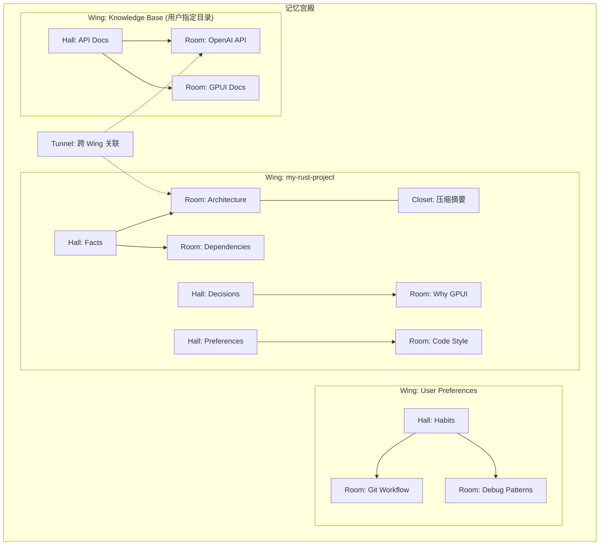

**层级结构（借鉴 MemPalace 的 Method of Loci）：**

- **Wing** — 顶层容器：一个项目、一个人、一个知识库目录
- **Hall** — 记忆类型分类：Facts / Events / Decisions / Preferences
- **Room** — 具体主题：Architecture / Dependencies / "Why GPUI"
- **Closet** — 压缩摘要 + 指向原始内容的索引
- **Tunnel** — 跨 Wing 关联（如：项目中的 API 设计 ↔ 知识库中的 API 文档）

### 8.2 渐进式加载（借鉴 MemPalace L0-L3）

| 级别   | 名称      | 加载时机              | 内容                                         | Token 预算 |
| ------ | --------- | --------------------- | -------------------------------------------- | ---------- |
| **L0** | Identity  | 每次请求              | 核心身份（"你是 Aineer，一个 AI 开发代理"）  | ~200       |
| **L1** | Essential | Session 启动          | 关键事实（tech stack、团队、项目规则、偏好） | ~2000      |
| **L2** | Context   | 每次请求              | 当前项目相关记忆 + 最近对话摘要              | ~3000      |
| **L3** | Deep      | 按需（@ 引用 / 搜索） | 全量语义搜索跨所有 Wing                      | ~5000      |

### 8.3 知识库（Knowledge Base）

用户可以指定一个或多个**目录作为知识库**（如 API 文档、设计文档、团队规范）：

```rust
// crates/memory/src/knowledge_base.rs

pub struct KnowledgeBase {
    pub name: String,               // "GPUI Docs"
    pub path: PathBuf,              // ~/docs/gpui/
    pub watch: bool,                // 文件变更自动重新索引
    pub file_patterns: Vec<String>, // ["*.md", "*.txt", "*.rs"]
}
```

- 知识库中的文件被索引为 Wing 中的 Room
- 支持增量索引（文件变更时只更新变化部分）
- 用户通过 `@kb:gpui-docs` 或 `/search` 命令引用知识库内容
- Settings 记忆页可添加/删除知识库目录

### 8.4 集成方案：MemPalace via MCP

**优先方案**：通过 MCP 集成 MemPalace（Python），而非 Rust 重写。

MemPalace 暴露 **24 个 MCP tools**（JSON-RPC 2.0），Aineer 已有完整的 MCP 客户端（`crates/mcp/`），可直接对接：

```json
// settings.json 中自动配置
{
  "mcpServers": {
    "mempalace": {
      "type": "stdio",
      "command": "mempalace",
      "args": ["mcp-server", "--palace-dir", "~/.aineer/memory/palace"]
    }
  }
}
```

**关键 MCP 工具映射：**

| MemPalace MCP Tool       | Aineer 使用场景                 |
| ------------------------ | ------------------------------- |
| `mempalace_search`       | AI 请求前检索相关记忆（L2/L3）  |
| `mempalace_save`         | 对话结束后自动保存有价值的内容  |
| `mempalace_kg_query`     | 知识图谱查询（时间线、关联）    |
| `mempalace_diary_write`  | /remember 命令手动记忆          |
| `mempalace_diary_read`   | 召回特定主题的历史决策          |
| `mempalace_wake_up`      | Session 启动时加载 L1 Essential |
| `mempalace_search_rooms` | @ 引用时搜索知识库              |

**Fallback 方案（无 Python 环境）**：内置轻量 Rust 实现，使用 SQLite + 关键词索引，不依赖向量数据库，覆盖基本的保存/检索/衰减功能。

### 8.5 记忆生命周期

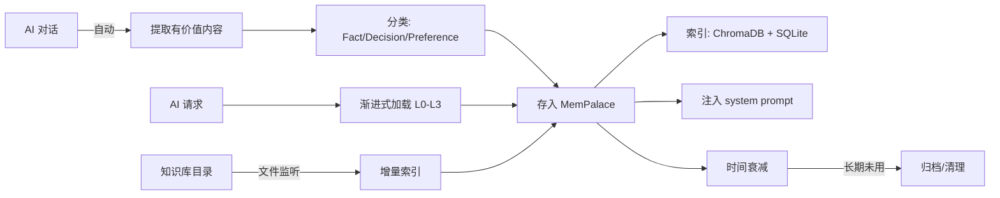

### 8.6 对 Agent 的影响

```rust
// crates/app/src/agent.rs

async fn build_context(
    memory: &MemoryClient,  // MCP client to MemPalace
    settings: &SettingsStore,
    query: &str,
    recent_blocks: &[Block],
) -> SystemPrompt {
    // L0: Identity (always)
    let identity = settings.merged().agent_identity();

    // L1: Essential (session startup, cached)
    let essential = memory.wake_up().await;

    // L2: Context (per-request, relevant to query)
    let context_memories = memory.search(query, limit: 10).await;

    // L3: Deep (only if user @ referenced memory)
    // triggered by @memory or @kb:name references

    SystemPrompt::build(identity, essential, context_memories)
}
```

---

## 9. SmartInputBar Rich Chat 能力（借鉴 Cursor Chat UI）

从 Cursor 的 AI Chat 界面借鉴关键模式，同时融合 Shell 特性：

```
┌─ 上下文指示栏（有引用时可见）──────────────────────────────┐
│  📎 3 文件   🖼 1 图片   @2 引用   [查看全部 ▾]          │
└──────────────────────────────────────────────────────────┘
┌─ 附件芯片区（有附件时可见）──────────────────────────────┐
│  [📎 main.rs 2.1KB ✕]  [🖼 screenshot.png ✕]           │
│  [@src/lib.rs ✕]  [@block#42 ✕]  [@kb:gpui-docs ✕]     │
└──────────────────────────────────────────────────────────┘
┌─ 输入框 ─────────────────────────────────────────────────┐
│  [Shell ▾]  ~/project (main) ❯ |                        │
│                                                          │
│                                                          │
├─ 底栏 ───────────────────────────────────────────────────┤
│  [📎] [📷] [@ ] [/ ]          [■ Stop] [⌘⏎ AI] [模型▾] │
└──────────────────────────────────────────────────────────┘
```

**借鉴 Cursor 的关键模式：**

- **上下文计数器**（如 Cursor 的 "26 Files"）：显示当前引用的文件、图片、Block 数量
- **底栏模型选择器**（如 Cursor 的 "Opus 4.6"）：右下角显示当前模型，可点击切换
- **Stop 按钮**（如 Cursor 的 "Stop ^C"）：AI 流式输出时显示，点击中断
- **Review 按钮**：当 AI 提出代码变更时，显示 Review 按钮进入 diff 审查
- **内联 diff 渲染**：AI 提出的代码修改直接在 AIBlock 中以红/绿 diff 显示

### 附件系统

| 附件类型 | 触发方式                                | 处理                            |
| -------- | --------------------------------------- | ------------------------------- |
| **文件** | 拖拽到输入框 / 点击📎浏览 / Cmd+Shift+A | 读取内容 → 作为 AI context      |
| **图片** | 粘贴剪贴板 / 拖拽 / 点击📷              | 多模态输入 → vision model 分析  |
| **截图** | Cmd+Shift+S（内置截图）                 | 截取屏幕区域 → 同图片处理       |
| **URL**  | 粘贴 URL / @url                         | 抓取网页内容摘要 → 作为 context |

附件以**芯片（Chip）**形式显示在输入框上方，每个芯片可单独删除。

### @ 引用系统

输入 `@` 弹出 Picker 浮层，支持：

| 引用目标       | 语法               | 注入内容                                 |
| -------------- | ------------------ | ---------------------------------------- |
| **文件**       | `@filename`        | 文件全文或摘要（大文件截断）             |
| **目录**       | `@dir/`            | 目录树 + 文件列表                        |
| **Block**      | `@block` 或 `@#42` | 历史 Block 的摘要（命令+输出 / AI 回复） |
| **Git diff**   | `@git` 或 `@diff`  | 当前 unstaged/staged changes             |
| **Git commit** | `@commit:abc123`   | commit 的 diff 和 message                |
| **URL**        | `@url:https://...` | 网页内容摘要                             |
| **记忆**       | `@memory`          | 相关项目/用户记忆                        |

Picker 支持模糊搜索，按类型分组显示。

### / 命令系统

输入 `/` 弹出命令菜单：

| 命令        | 功能                      | 参数                 |
| ----------- | ------------------------- | -------------------- |
| `/fix`      | 修复上一条失败命令        | 无（自动取最近错误） |
| `/explain`  | 解释选中的代码/输出       | 可选 Block 引用      |
| `/test`     | 为指定文件生成测试        | @file                |
| `/review`   | 代码审查                  | @git / @file         |
| `/commit`   | 根据 diff 生成 commit msg | 无（自动取 staged）  |
| `/deploy`   | 执行部署流程              | Skill 模板           |
| `/remember` | 手动添加记忆              | 文本                 |
| `/forget`   | 删除特定记忆              | 记忆搜索             |
| `/model`    | 临时切换模型              | provider/model       |
| `/clear`    | 清除当前 Stream           | 无                   |

命令支持 Tab 补全和参数提示。

---

## 10. Block 数据模型

```rust
// crates/ui/src/blocks/mod.rs

pub type BlockId = u64;

pub enum Block {
    Command(CommandBlock),
    AI(AIBlock),
    Tool(ToolBlock),
    System(SystemBlock),
    Diff(DiffBlock),
    AgentPlan(AgentPlanBlock),      // Agent 模式多步执行
}

pub struct BlockMeta {
    pub id: BlockId,
    pub created_at: DateTime<Utc>,
    pub collapsed: bool,
    pub parent_id: Option<BlockId>, // Agent step 的父 AgentPlanBlock
    pub tags: Vec<String>,          // 用于搜索过滤
}

pub struct CommandBlock {
    pub meta: BlockMeta,
    pub command: String,
    pub cwd: PathBuf,
    pub terminal_content: TerminalContent,
    pub exit_code: Option<i32>,
    pub duration: Option<Duration>,
    pub ai_diagnosis: Option<BlockId>,
}

pub struct AIBlock {
    pub meta: BlockMeta,
    pub model: SelectedModel,       // provider_id/model_id
    pub role: Role,                 // User | Assistant
    pub content: String,            // Markdown
    pub streaming: bool,
    pub token_count: Option<u32>,   // token 用量追踪
    pub context_refs: Vec<ContextRef>, // 此消息引用的上下文
    pub executable_snippets: Vec<CodeSnippet>,
}

pub struct CodeSnippet {
    pub language: String,
    pub code: String,
    pub executed: bool,
    pub result_block_id: Option<BlockId>, // 执行结果 Block
}

pub enum ContextRef {
    Block(BlockId),
    File(PathBuf),
    GitDiff(String),
    Url(String),
    Memory(String),
}

pub struct ToolBlock {
    pub meta: BlockMeta,
    pub tool_use_id: String,
    pub name: String,
    pub input: String,
    pub state: ToolState,           // Pending | Running | Completed | Denied
}

pub struct AgentPlanBlock {
    pub meta: BlockMeta,
    pub goal: String,               // 用户的高级意图
    pub steps: Vec<AgentStep>,
    pub state: AgentPlanState,      // Planning | Executing | AwaitApproval | Completed | Failed | Cancelled
    pub approval_policy: ApprovalPolicy,
}

pub struct AgentStep {
    pub index: usize,
    pub description: String,
    pub state: StepState,           // Pending | Running | Completed | Failed | NeedsApproval
    pub child_block_id: Option<BlockId>, // 嵌套的 CommandBlock/ToolBlock
    pub duration: Option<Duration>,
    pub is_dangerous: bool,
}

pub enum ApprovalPolicy {
    AlwaysApprove,                  // 全自动
    DangerousOnly,                  // 仅危险命令审批
    AlwaysAsk,                      // 每步都审批
}

pub struct SystemBlock {
    pub meta: BlockMeta,
    pub kind: SystemKind,           // DirChange | Error | Info | Welcome | ProactiveHint
    pub message: String,
}

pub struct DiffBlock {
    pub meta: BlockMeta,
    pub file_path: String,
    pub hunks: Vec<DiffHunk>,
    pub stats: DiffStats,
}
```

---

## 11. 数据流与事件系统

### 11.1 Shell 命令执行流

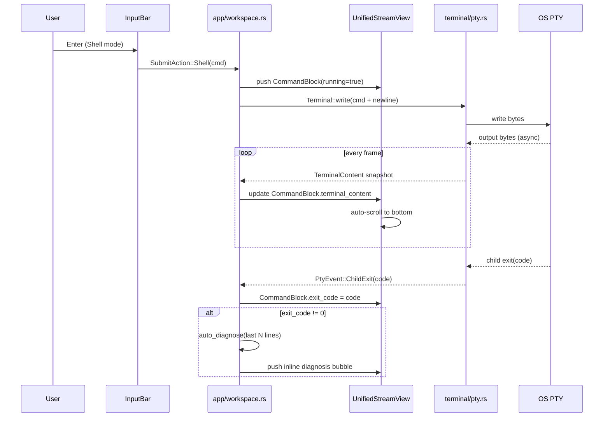

### 11.2 AI Chat 流

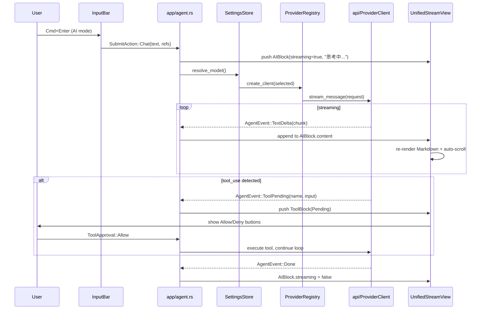

### 11.3 事件类型定义（跨 crate 通信合约）

```rust
// crates/protocol/ 或 crates/app/ 中定义

// Terminal → App
pub enum PtyEvent {
    Output,                     // TerminalContent 已更新（轮询模式）
    ChildExit(Option<i32>),     // 子进程退出
    Title(String),              // 终端标题变更
    Bell,                       // 终端响铃
    Exit,                       // PTY 关闭
}

// Agent → App
pub enum AgentEvent {
    TextDelta(String),
    ToolPending { tool_use_id: String, name: String, input: String },
    ToolRunning { tool_use_id: String },
    ToolResult { tool_use_id: String, output: String, is_error: bool },
    Error(String),
    Done,
}

// App → Agent
pub enum ToolApproval {
    Allow,
    Deny,
    AllowAll,
}

// Gateway 状态
pub enum GatewayStatus {
    Starting,
    Running(SocketAddr),
    Stopped,
    Error(String),
}

// UI 内部动作
pub enum WorkspaceAction {
    NewTab,
    CloseTab(TabId),
    SwitchTab(TabId),
    ToggleSidebar,
    OpenSettings,
    OpenCommandPalette,
    ToggleFullscreenTerminal,
}
```

### 11.4 Tauri IPC 桥接模式

Tauri 2 使用 tokio 运行时（与 Aineer 后端一致），通过 IPC commands 和 events 桥接前端与后端：

**Request-Response（前端 → 后端）：** 使用 `invoke()` 调用 Rust `#[tauri::command]`

```typescript
// ui/ 前端调用
const result = await invoke<SpawnPtyResult>("spawn_pty", {
  shell: "/bin/zsh",
  cwd: "/home",
});
```

```rust
// app/src/commands/shell.rs
#[tauri::command]
async fn spawn_pty(shell: String, cwd: String) -> Result<PtyId, String> {
    // 直接使用 tokio，无需运行时桥接
    let pty = aineer_terminal::spawn(&shell, &cwd).await?;
    Ok(PtyId { id: pty.id() })
}
```

**Streaming（后端 → 前端）：** 使用 `app.emit()` 推送事件

```rust
// PTY 输出流推送
app_handle.emit("pty-output", PtyOutputPayload { pty_id, data }).ok();
```

```typescript
// ui/ 前端监听
listen<PtyOutput>("pty-output", (event) => {
  terminal.write(event.payload.data);
});
```

由于 Tauri 原生使用 tokio，不再需要 smol/async-task 桥接层。

---

## 12. 错误处理策略

### 12.1 错误分层

```rust
// 每个 crate 定义自己的 Error 类型，使用 thiserror

// crates/provider/
#[derive(Debug, thiserror::Error)]
pub enum ProviderError {
    #[error("Provider '{0}' not found")]
    NotFound(ProviderId),
    #[error("Not authenticated for {provider}: {message}")]
    NotAuthenticated { provider: ProviderId, message: String },
    #[error("Model '{model}' not available for provider '{provider}'")]
    ModelNotAvailable { provider: ProviderId, model: ModelId },
    #[error("API error: {0}")]
    Api(#[from] api::ApiError),
    #[error("Credential error: {0}")]
    Credential(String),
}

// crates/settings/
#[derive(Debug, thiserror::Error)]
pub enum SettingsError {
    #[error("Failed to read {path}: {source}")]
    ReadFile { path: PathBuf, source: std::io::Error },
    #[error("Invalid JSON in {path}: {source}")]
    ParseJson { path: PathBuf, source: serde_json::Error },
    #[error("Failed to write {path}: {source}")]
    WriteFile { path: PathBuf, source: std::io::Error },
}
```

### 12.2 用户可见的错误表现

| 错误场景            | UI 表现                                                  |
| ------------------- | -------------------------------------------------------- |
| API Key 未配置      | AIBlock 显示红色错误 + "前往 Settings 配置 API Key" 链接 |
| Provider API 超时   | AIBlock 底部 "请求超时，[重试]"                          |
| 模型不可用          | AIBlock 显示 "模型 X 不可用" + 自动 fallback 到下一个    |
| Shell 命令失败      | CommandBlock 红色退出码 + AI 诊断气泡                    |
| PTY 创建失败        | SystemBlock 红色 "无法启动终端" + 详细错误               |
| Gateway 启动失败    | StatusBar 红灯 + Toast 错误通知                          |
| Settings 保存失败   | Toast "设置保存失败" + 详细错误                          |
| MCP Server 连接失败 | MCP 列表中对应行显示红色 + 错误详情                      |
| 网络断开            | StatusBar 显示 "离线" + 队列请求                         |

---

## 13. Session 持久化格式

```rust
// crates/app/src/session.rs

#[derive(Debug, Serialize, Deserialize)]
pub struct SessionData {
    pub version: u32,                   // schema version for migration
    pub tabs: Vec<TabSession>,
    pub active_tab_index: usize,
    pub sidebar_visible: bool,
    pub sidebar_width: f32,
}

#[derive(Debug, Serialize, Deserialize)]
pub struct TabSession {
    pub id: u64,
    pub title: String,
    pub working_dir: PathBuf,
    pub blocks: Vec<BlockData>,         // serialized Block history
    pub scroll_position: f64,
}

#[derive(Debug, Serialize, Deserialize)]
pub struct BlockMetaData {
    pub id: u64,
    pub created_at: String,             // ISO 8601
    pub collapsed: bool,
    pub parent_id: Option<u64>,
    pub tags: Vec<String>,
}

#[derive(Debug, Serialize, Deserialize)]
#[serde(tag = "type")]
pub enum BlockData {
    Command {
        meta: BlockMetaData,
        command: String,
        cwd: String,
        output_text: String,            // plain text snapshot (not TerminalContent)
        exit_code: Option<i32>,
        duration_ms: Option<u64>,
    },
    AI {
        meta: BlockMetaData,
        model: String,                  // "provider_id/model_id"
        role: String,
        content: String,
        token_count: Option<u32>,
        context_refs: Vec<String>,      // serialized ContextRef
    },
    Tool {
        meta: BlockMetaData,
        name: String,
        input: String,
        output: String,
        is_error: bool,
    },
    AgentPlan {
        meta: BlockMetaData,
        goal: String,
        steps: Vec<AgentStepData>,
        state: String,                  // "completed" | "failed" | "cancelled"
    },
    System {
        meta: BlockMetaData,
        kind: String,
        message: String,
    },
}

#[derive(Debug, Serialize, Deserialize)]
pub struct AgentStepData {
    pub index: usize,
    pub description: String,
    pub state: String,
    pub child_block_id: Option<u64>,
    pub duration_ms: Option<u64>,
}

// 存储路径: ~/.aineer/sessions/{session_id}.json
// 索引文件: ~/.aineer/sessions/index.json (session 列表, 用于 Welcome 屏最近 Sessions)
// 自动保存: 窗口关闭 + 每 5 分钟 + 每个 Block 完成时增量追加
// 全文索引: ~/.aineer/sessions/search.idx (tantivy 索引, 用于跨 Session 搜索)
```

---

## 14. 依赖规格

### 14.1 依赖模板

**Root `Cargo.toml`**

```toml
[workspace]
members = ["crates/*", "app"]
default-members = ["app"]
resolver = "2"

[workspace.dependencies]
# Async
tokio = { version = "1", features = ["full"] }
async-trait = "0.1"
futures-core = "0.3"

# Serialization
serde = { version = "1", features = ["derive"] }
serde_json = "1"

# Error handling
thiserror = "2"
anyhow = "1"

# Logging
tracing = "0.1"
tracing-subscriber = { version = "0.3", features = ["env-filter"] }

# Terminal (desktop PTY)
portable-pty = "0.9"

# Git
git2 = { version = "0.19", default-features = false }

# HTTP
reqwest = { version = "0.12", features = ["json", "stream"] }
axum = { version = "0.8", features = ["ws"] }

# Syntax
syntect = "5"

# Credentials
keyring = "3"

# Search（规划中：跨 Session 全文索引，当前仓库未加入 workspace 依赖）
# tantivy = "0.22"

# Utilities
chrono = { version = "0.4", features = ["serde"] }
uuid = { version = "1", features = ["v4", "serde"] }
strum = { version = "0.27", features = ["derive"] }
base64 = "0.22"
notify = "7"

# Internal crates
aineer-protocol = { version = "*", path = "crates/protocol" }
aineer-api = { version = "*", path = "crates/api" }
aineer-provider = { version = "*", path = "crates/provider" }
aineer-settings = { version = "*", path = "crates/settings" }
aineer-engine = { version = "*", path = "crates/engine" }
aineer-tools = { version = "*", path = "crates/tools" }
aineer-gateway = { version = "*", path = "crates/gateway" }
aineer-mcp = { version = "*", path = "crates/mcp" }
aineer-lsp = { version = "*", path = "crates/lsp" }
aineer-plugins = { version = "*", path = "crates/plugins" }
aineer-cli = { version = "*", path = "crates/cli" }
aineer-memory = { version = "*", path = "crates/memory" }
aineer-channels = { version = "*", path = "crates/channels" }
aineer-auto-update = { version = "*", path = "crates/auto_update" }
aineer-release-channel = { version = "*", path = "crates/release_channel" }
```

**前端 `package.json` 核心依赖**

```json
{
  "dependencies": {
    "react": "^19",
    "react-dom": "^19",
    "@tauri-apps/api": "^2.10",
    "@tauri-apps/plugin-opener": "^2",
    "@xterm/xterm": "^6.0",
    "@xterm/addon-fit": "^0.11",
    "@xterm/addon-webgl": "^0.19",
    "@xterm/addon-unicode11": "^0.9",
    "class-variance-authority": "^0.7",
    "clsx": "^2",
    "tailwind-merge": "^3",
    "lucide-react": "^1",
    "radix-ui": "^1.4",
    "react-markdown": "^10",
    "remark-gfm": "^4",
    "remark-breaks": "^4",
    "marked": "^18",
    "shiki": "^4",
    "use-stick-to-bottom": "^1"
  },
  "devDependencies": {
    "@biomejs/biome": "^2.4",
    "@tauri-apps/cli": "^2.10",
    "@tailwindcss/cli": "^4.2",
    "tailwindcss": "^4",
    "typescript": "~5.8",
    "@types/bun": "^1.3",
    "@types/node": "^25",
    "@types/react": "^19",
    "@types/react-dom": "^19"
  }
}
```

> **注意**：不使用 Vite，前端构建完全由 Bun 自定义脚本 (`scripts/build.ts`) 处理，CSS 由 `@tailwindcss/cli` 处理。

**`crates/provider/Cargo.toml`**

```toml
[package]
name = "aineer-provider"
version = "0.1.0"
edition = "2021"

[dependencies]
aineer-protocol.workspace = true
aineer-api.workspace = true
serde.workspace = true
serde_json.workspace = true
thiserror.workspace = true
async-trait.workspace = true
keyring.workspace = true
tracing.workspace = true
reqwest.workspace = true
```

**`crates/settings/Cargo.toml`**

```toml
[package]
name = "aineer-settings"
version = "0.1.0"
edition = "2021"

[dependencies]
aineer-protocol.workspace = true
serde.workspace = true
serde_json.workspace = true
thiserror.workspace = true
tracing.workspace = true
notify = "7"           # file watcher
```

**`crates/terminal/Cargo.toml`**（无 egui）

```toml
[package]
name = "aineer-terminal"
version = "0.1.0"
edition = "2021"

[dependencies]
alacritty_terminal.workspace = true
serde.workspace = true
thiserror.workspace = true
tracing.workspace = true
```

**`app/Cargo.toml`**（Tauri 2 桌面应用入口 + CLI 宿主）

```toml
[package]
name = "aineer"
version.workspace = true
edition.workspace = true
description = "Aineer — Agentic Development Environment"

[[bin]]
name = "aineer"
path = "src/main.rs"

[lib]
name = "aineer_lib"
crate-type = ["staticlib", "cdylib", "rlib"]

[build-dependencies]
tauri-build = { version = "2", features = [] }

[dependencies]
tauri = { version = "2", features = [] }
tauri-plugin-opener = "2"
serde.workspace = true
serde_json.workspace = true
tokio.workspace = true
tracing.workspace = true
tracing-subscriber.workspace = true
anyhow.workspace = true
chrono.workspace = true
thiserror.workspace = true
portable-pty.workspace = true
dirs = "6"

# Workspace crates (business logic)
aineer-api.workspace = true
aineer-auto-update.workspace = true
aineer-channels.workspace = true
aineer-cli.workspace = true
aineer-engine.workspace = true
aineer-gateway.workspace = true
aineer-lsp.workspace = true
aineer-mcp.workspace = true
aineer-memory.workspace = true
aineer-plugins.workspace = true
aineer-provider.workspace = true
aineer-protocol.workspace = true
aineer-release-channel.workspace = true
aineer-settings.workspace = true
aineer-tools.workspace = true
```

> **注意**：`crates/ui` crate 已删除。Block 数据模型和 Session 持久化逻辑直接在 `app/src/blocks/` 和 `app/src/session.rs` 中实现。桌面终端使用 **`portable-pty`**（非独立 `aineer-terminal` crate）；主题在前端 `ui/`。

---

## 15. 测试策略

### 15.1 测试层级

| 层级                    | 目标              | 工具                | 覆盖内容                                                                             |
| ----------------------- | ----------------- | ------------------- | ------------------------------------------------------------------------------------ |
| **单元测试**            | 各 crate 内部逻辑 | `#[test]`           | SettingsStore 深度合并、ProviderRegistry 注册/查找、SelectedModel 解析、Block 序列化 |
| **集成测试**            | crate 间协作      | `tests/` 目录       | settings 加载 → provider 创建 → client 构造；session 保存/恢复                       |
| **前端测试**            | React 组件        | bun test            | Block 渲染、InputBar 状态切换、Tauri IPC mock                                        |
| **Design Token 一致性** | token 覆盖率      | biome lint          | 扫描 UI 代码，确保使用 CSS variables / Tailwind classes                              |
| **主题切换测试**        | 暗/亮主题视觉     | 浏览器截图          | 所有组件在 Dark/Light 主题下渲染对比                                                 |
| **对比度检测**          | 可访问性合规      | 自定义检查脚本      | 所有 (text, background) token 对的 WCAG AA 对比度 >= 4.5:1                           |
| **E2E 测试**            | 完整用户流程      | Tauri driver + 手动 | 启动 → 输入命令 → AI 对话 → Agent 执行 → 设置修改                                    |

### 15.2 关键测试用例

```rust
// crates/settings/tests/merge_test.rs
#[test]
fn save_preserves_unknown_keys() {
    // 文件中有 mcpServers + hooks
    // GUI 只保存 theme 变更
    // 验证 mcpServers + hooks 仍存在
}

#[test]
fn model_alias_resolution() {
    // model = "sonnet"
    // modelAliases = { "sonnet": "claude-sonnet-4-6" }
    // 验证解析为 SelectedModel { provider: "anthropic", model: "claude-sonnet-4-6" }
}

// crates/provider/tests/registry_test.rs
#[test]
fn register_and_find_provider() { ... }

#[test]
fn selected_model_from_str() {
    assert_eq!("anthropic/claude-sonnet-4-6".parse::<SelectedModel>().unwrap(), ...);
    assert_eq!("gpt-4o".parse::<SelectedModel>().unwrap(), ...);  // auto-detect provider
}

#[test]
fn fallback_on_auth_failure() { ... }

// crates/terminal/tests/
#[test]
fn terminal_content_snapshot() { ... }

// crates/app/tests/
#[test]
fn session_save_and_restore() { ... }
```

---

## 16. 架构总览

### 16.1 产品-UI-技术三层对齐

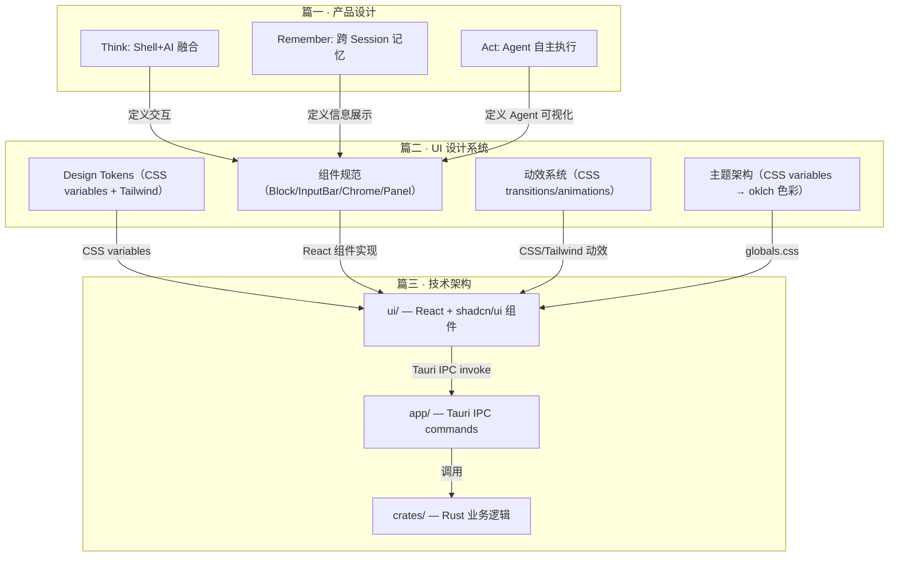

### 16.2 技术架构图

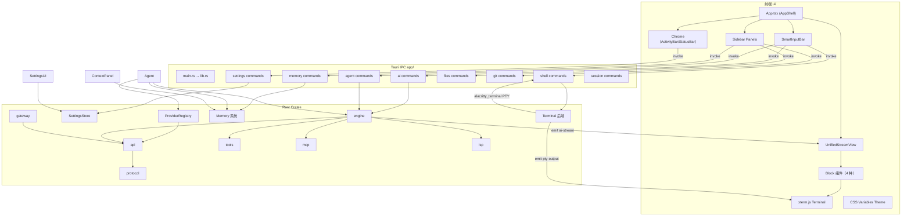

### 16.3 Design Token → 代码映射

UI 设计系统（篇二）的 Design Token 在代码中的落地路径：

| UI 设计系统 Token            | CSS / 代码位置                                 | 实现方式                                  |
| ---------------------------- | ---------------------------------------------- | ----------------------------------------- |
| `background`, `surface`, ... | `--background`, `--card` CSS variables         | oklch 色彩，在 `globals.css` `:root` 定义 |
| `accent.ai`, `accent.agent`  | `--ai`, `--agent` CSS variables                | Tailwind classes: `text-ai`, `bg-agent`   |
| `font.mono`, `font.sans`     | `body { font-family }`, `.font-mono`           | CSS font-family 定义                      |
| `font.size.*`                | Tailwind `text-xs`, `text-sm`, `text-base`     | 使用 Tailwind 默认字号系统                |
| `space.*`                    | Tailwind `p-2`, `gap-3`, `m-4`                 | 使用 Tailwind 默认间距系统                |
| `radius.*`                   | `--radius` CSS variable + Tailwind `rounded-*` | shadcn/ui 标准圆角体系                    |
| `shadow.*`                   | Tailwind `shadow-sm`, `shadow-md`              | 使用 Tailwind 默认阴影系统                |
| `ease.*`                     | CSS `transition-timing-function`               | CSS transitions / Tailwind `transition-*` |

**使用方式：** 组件通过 Tailwind 工具类引用 CSS variables 定义的语义色彩，所有视觉属性均通过 token 引用，不在组件代码中硬编码任何色值、字号或间距。主题切换通过修改 `:root` CSS variables 实现。

---

## 17. 实施阶段

### Phase 0: 项目重启 + 核心基础设施（1.5 周）

**0.1 清空与重建**

```bash
# 1. 删除 target/
rm -rf target/

# 2. 备份到兄弟目录
cp -r . ../aineer-legacy/

# 3. 清空项目目录（保留 .git/ 和 .gitignore）
#    删除所有文件和目录，保留 .git* 和必要的 dotfiles
find . -maxdepth 1 ! -name '.' ! -name '.git' ! -name '.gitignore' -exec rm -rf {} +

# 4. 初始化新 workspace
# （由 AI 辅助创建 Cargo.toml + 目录结构）
```

**0.2 回收框架无关 crate**

- 从 `../aineer-legacy/crates/` 复制 9 个 crate：`protocol`、`api`、`engine`、`tools`、`gateway`、`mcp`、`lsp`、`plugins`、`cli`
- 更新 root `Cargo.toml` 的 workspace members
- 验证 `cargo check` 通过（仅后端 crate）

**0.3 新建 `crates/provider/`**

- 借鉴 Zed `language_model/src/registry.rs` → `ProviderRegistry` + `SelectedModel`
- 借鉴 Zed `credentials_provider/` → `CredentialsManager`（env + 系统钥匙串）
- 实现 10 个内置 Provider（借鉴 Zed 各 provider 实现）
- 修改 `api` crate：`ProviderClient::from_model()` 委托给 `ProviderRegistry`
- 修改 `cli` crate：model 选择改用 `ProviderRegistry`

**0.4 新建 `crates/settings/`**

- 借鉴 Zed `settings/src/settings_store.rs` → `SettingsStore`（深度合并）
- 定义 `SettingsContent`（统一字段名，`#[serde(flatten)]` 保留未知 key）
- 修改 `engine/src/config/loader.rs`：从新 `SettingsStore` 读取配置
- 旧字段名向后兼容：`default_model` → `model`，`fallback_models` (comma) → `fallbackModels` (array)

**验收标准：** `cargo check` 全 crate 通过；`cargo test` 后端测试通过；`ProviderRegistry` 可注册/查找 Provider；`SettingsStore` 深度合并不丢失 key。

---

### Phase 1: Tauri + React 基础 + 终端（1.5 周）

**1.1 Tauri 环境**

- `app/` 目录：Tauri Rust 后端，IPC commands 桥接 workspace crates
- `ui/` 目录：React 19 + shadcn/ui + Tailwind CSS 前端
- 工具链：bun (包管理/运行时) + Vite (bundler) + biome (lint/format)
- 验证 `bun run tauri dev` 能打开窗口

**1.2 主题系统**

- CSS variables 定义在 `ui/styles/globals.css`，oklch 色彩空间
- Tailwind `@theme inline` 映射语义 token 为工具类
- 暗色优先 + AI/Agent 专属强调色
- shadcn/ui 原生主题支持

**1.3 窗口 + 布局**

- `App.tsx`：AppShell 三栏布局（ActivityBar | 主区域 | Sidebar）
- React 组件：ActivityBar / Sidebar / StatusBar
- Tailwind 响应式：Sidebar 可折叠（⌘B toggle）

**1.4 终端集成**

- Rust 后端 `crates/terminal/`：PTY 管理（alacritty_terminal）
- Tauri IPC：`spawn_pty` / `write_pty` / `resize_pty` / `kill_pty`
- PTY 输出通过 Tauri events (`pty-output`) 推送到前端
- 前端使用 xterm.js + WebGL addon 渲染终端
- 支持 Inline（嵌入 CommandBlock）和 Fullscreen 两种模式

**验收标准：** 能在窗口中看到三栏布局 + 暗色主题；能创建 PTY 并在 xterm.js 中看到 Shell 提示符。

---

### Phase 2: 对话式终端核心（2.5 周）

**2.1 Block 模型**

- `crates/ui/src/blocks/mod.rs`：Block enum + 各 Block struct (Rust 纯数据结构)
- `ui/components/blocks/`：React 组件渲染每种 Block 类型
- BlockMeta 统一元数据（id, timestamp, collapsed, parent_id, tags）

**2.2 UnifiedStreamView**

- `ui/components/UnifiedStreamView.tsx`
- React 虚拟列表（react-virtuoso）
- Block 渲染分发：switch block.type { command / ai / tool / system / ... }
- 自动滚动：新 Block 到达时 scrollIntoView（用户手动上滚时暂停）
- Alternate screen 检测 → 隐藏 StreamView，显示全屏 xterm.js
- Block 键盘导航：上下箭头在 Block 间移动，Enter 展开/折叠
- Block 内搜索：Cmd+F 高亮匹配

**2.3 AIBlock 渲染**

- React Markdown 组件渲染 AI 回复（react-markdown + rehype-highlight）
- 可执行代码块：检测 ` ```bash ` → 渲染 [Run] / [Run All] 按钮 → 通过 Tauri IPC 写入 PTY
- 流式更新：通过 Tauri events 逐 token 接收，React state 更新
- Token 计数显示：完成后底栏 `384 tokens · 1.2s`
- 错误自动诊断：CommandBlock.exit_code != 0 → 自动发送输出给 Agent → 内嵌诊断气泡
- 主动行为：长任务检测（>30s）+ 重复命令检测（3 次）+ 危险命令拦截

**2.4 SmartInputBar（Rich Chat，三模式）**

- 底部固定，包含上下文芯片区 + 输入框 + 工具栏
- **三模式指示器** `[Shell]` / `[AI]` / `[Agent]`，点击切换或快捷键
  - Shell: Enter=执行，CWD + Git 分支 + ghost text 补全
  - AI Chat: Cmd+Enter=发送，模型选择器 + token 预算预览
  - Agent: Cmd+Shift+Enter=启动，审批策略指示器
- **@ 引用 Picker**（@file, @block, @git, @url, @memory, @model:xxx）+ 模糊搜索
- **/ 命令菜单**（/fix, /explain, /test, /deploy, /agent, /search, /memory, /model...）
- **附件**：拖拽/粘贴文件、Cmd+Shift+A 浏览、文件以芯片显示
- **截图/图片**：Cmd+Shift+S 截屏、粘贴剪贴板图片 → 多模态输入
- 智能模式建议：输入自然语言 → 右侧淡入 `⌘⏎ AI`；检测多步意图 → `⌘⇧⏎ Agent`
- 多行输入：Shift+Enter 换行，高度自适应（最高 8 行）

**2.5 Agent 模式引擎**

- `crates/engine/src/agent_planner.rs`：Plan+Execute 编排器
  - 接收用户高级意图 → 调用 AI 生成执行计划（steps）
  - 逐步执行：shell 命令 / tool call / file operation
  - 审批策略：`ApprovalPolicy::AlwaysApprove | DangerousOnly | AlwaysAsk`
  - 危险命令检测规则：`rm -rf`、`DROP`、`force push`、生产环境相关
- `crates/ui/src/blocks/agent_plan_block.rs`：AgentPlanBlock 可视化
  - 进度条 + 步骤列表 + 状态图标（✅⏳🔒✗）
  - 步骤可展开查看嵌套 CommandBlock/ToolBlock
  - [■ 终止] 按钮随时中止
- 审批推送：本地弹窗 + 可选推送到飞书/微信（Phase 5）

**2.6 事件桥接（Tauri IPC）**

- Terminal → UI: Rust spawn tokio task → `app.emit("pty-output", data)` → React `listen()`
- Agent → UI: `app.emit("agent-event", data)` → React state 更新
- AI Stream → UI: `app.emit("ai-stream", delta)` → React 逐 token 渲染
- Gateway → UI: `app.emit("gateway-status", status)` → StatusBar 更新
- UI → Terminal: `invoke("write_pty", {id, data})` → Rust 直接写 PTY
- UI → Agent: `invoke("start_agent", {goal})` / `invoke("approve_tool", {id})` → Rust Agent 引擎

**验收标准：** 能输入 shell 命令看到带 ANSI 颜色的终端输出；能发送 AI 对话看到流式 Markdown；AI 代码块有 Run 按钮；命令失败自动触发 AI 诊断；Agent 模式可规划+执行多步任务。

---

### Phase 3: 面板 + 搜索 + Settings + Chrome（2.5 周）

**3.1 ExplorerPanel**

- `std::fs::read_dir` + `git2::Repository::statuses` 装饰
- `uniform_list` 虚拟化
- 单击 → DiffViewer / FileViewer；右键 → 上下文菜单

**3.2 DiffViewer（4 模式）**

- Unified diff（默认）、Side-by-side、New Only、Old Only
- 语法高亮（`syntect`）+ Hunk 导航

**3.3 全局搜索系统**

- `crates/app/src/search/`
- **Block 搜索**：当前 Session 内全文搜索，支持正则
- **跨 Session 搜索**：使用 `tantivy` 构建全文索引，搜索所有历史 Session
- **语义搜索**：可选，通过 Embedding API 实现，自然语言查询（"上次修 Docker 那个问题"）
- **文件搜索**：工作目录文件名模糊搜索（Cmd+P Quick Open）
- Sidebar Search 面板：统一搜索入口，结果按类型分组（Block / File / Memory）

**3.4 Context Panel（AI 上下文可视化）**

- Sidebar 可切换到 Context 面板
- 显示 AI 当前"看到"的全部上下文：
  - 最近 N 条 Block（自动纳入）
  - 手动 @ 引用的文件/Block
  - 注入的记忆片段
  - System prompt 摘要
- **Token 预算进度条**：已用 / 模型上限，可视化百分比
- 用户可手动移除不需要的上下文项
- 自动上下文管理：接近上限时，旧 Block 自动摘要（summary）而非截断

**3.5 SettingsPanel UI（按用户意图分页，见 6.4 详细规格）**

- 8 页：外观 / 模型与智能 / 能力 / 渠道 / 终端 / 记忆 / 安全 / JSON
- **模型与智能**（核心）：统一 Provider 管理 + 模型选择器 + API Key + 别名 + Fallback
- **能力**：Tools + MCP + Skills + Plugins 有机融合
- **渠道**：Gateway + 飞书/微信/WhatsApp 配置入口
- 所有变更通过 `SettingsStore::save_user()` 保存

**3.6 Chrome**

- ActivityBar（左 48px）：Explorer / Search / Git / Context / Memory / Settings 图标
- StatusBar（底 24px）：Gateway 灯 + Git 分支 + CWD + 当前模型 + Token 用量 + 通知气泡
- CommandPalette（Cmd+Shift+P）：fuzzy search + Action 列表 + 最近使用优先排序
- Toast 通知系统 + 快捷键系统
- 通知中心：Agent 后台任务完成、渠道消息、更新提示

**核心快捷键：** Cmd+T/W/1-9（Tab），Cmd+Shift+P（Palette），Cmd+P（Quick Open），Cmd+Shift+F（全局搜索），Cmd+B（Sidebar），Cmd+,（Settings），Cmd+Enter（AI），Cmd+Shift+Enter（Agent），Ctrl+C/L（终端），Cmd+Shift+S（截图）

**验收标准：** Settings 所有 8 页可用；Provider 统一管理生效；Agent 使用配置的模型；Explorer + DiffViewer 正常；搜索可跨 Session 查找历史 Block；Context 面板正确显示 AI 上下文。

---

### Phase 4: 记忆 + Git + 打磨（1.5 周）

**4.1 Memory 系统**

- 新建 `crates/memory/`
- ProjectMemory：自动识别 tech stack（扫描 Cargo.toml/package.json/Dockerfile 等）
- UserMemory：从 AI 对话自动提取偏好（低置信度），用户确认后升级
- DecisionLog：/remember 命令手动记录，对话中明确决策自动捕捉
- 注入策略：每次 AI 请求前检索相关记忆注入 system prompt
- Settings 记忆页：查看/编辑/删除记忆，导出/清除功能

**4.2 Git 集成**

- Explorer 文件名颜色 = git status
- StatusBar 分支名 + dirty 指示器
- `git diff` 输出自动渲染为 DiffBlock

**4.3 主题与视觉**

- 暗/亮切换 + 主题持久化
- CSS transitions / Tailwind 动画
- 1.8 节定义的全部动效实现

**4.4 Session 持久化 + 性能**

- Session 保存/恢复（格式见第 11 节）
- Stream 虚拟列表 + 超长输出折叠 + 终端视口裁剪

---

### Phase 5: 渠道 + 打包（2 周）

**5.1 Channels 适配层**

- 新建 `crates/channels/`
- 统一消息协议：`ChannelMessage { source, text, attachments, reply_to }`
- Gateway 已在 Phase 0 就绪（HTTP API）
- **飞书机器人**：Open Platform Event Subscription → 接收 @提及 → 调用 Agent → 回复消息（Rich Card）
- **微信机器人**：公众号/企业微信 API → 同上
- **WhatsApp**：Meta Cloud API Webhook → 同上
- 所有渠道共享同一 ProviderRegistry + MemoryStore + ToolRegistry
- Settings 渠道页可配置各渠道凭证和行为

**5.2 打包工具链（Tauri Bundler）**

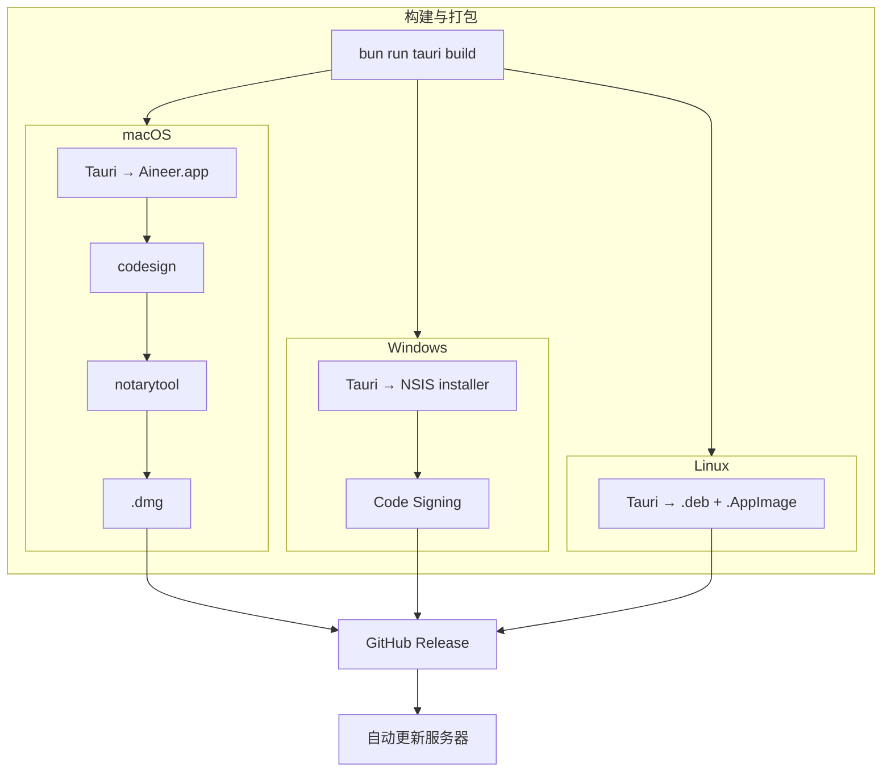

**5.2 自动更新**（`crates/auto_update/`，借鉴 Zed）

- 客户端每小时 HTTP 轮询
- 平台特定安装（macOS rsync / Linux tar / Windows 静默安装器）

**5.3 Release Channel**（`crates/release_channel/`）

| Channel | 触发                 | 分发                     |
| ------- | -------------------- | ------------------------ |
| dev     | 本地构建             | 不分发                   |
| stable  | Git tag `v1.2.3`     | GitHub Release           |
| preview | Git tag `v1.2.3-pre` | GitHub Release (preview) |
| nightly | Cron                 | 对象存储                 |

**5.4 CI/CD（GitHub Actions）**

- `ci.yml`: PR → test + clippy + fmt（三平台矩阵）
- `release.yml`: tag `v*` → 并行打包 → 上传 Release
- `nightly.yml`: Cron → 打包 → 上传

**5.5 增长引擎**

- **分享卡片生成**：Block/Session → 生成带语法高亮的分享图片（PNG），适合社交媒体传播
- **Session 分享链接**：通过 Gateway 生成只读 Session URL，同事可在浏览器查看完整 Block 流
- **Block 永久链接**：`aineer://block/<session_id>/<block_id>`，可在团队内引用特定的命令/AI 回答
- **Skill 社区**（后续）：用户创建的 /command 工作流可发布/安装
- **Daily Digest**（可选）：每日开发统计推送到飞书/微信/邮件

---

## 18. 关键技术决策

| 决策项          | 选择                                                           | 理由                                                                                                                   |
| --------------- | -------------------------------------------------------------- | ---------------------------------------------------------------------------------------------------------------------- |
| 重写策略        | **全新画布**，不渐进迁移                                       | 第一性原理；不妥协；旧代码仅作营养                                                                                     |
| 文档结构        | **三篇章**（产品/UI 系统/技术）                                | 产品驱动设计，设计驱动实现，三者对齐                                                                                   |
| **桌面框架**    | **Tauri 2** (v2.10)                                            | 跨平台；前后端分离；Rust 后端原生 tokio；Web 前端生态丰富                                                              |
| **前端框架**    | **React 19** + **shadcn/ui** + **Prompt Kit**                  | 成熟生态 + 高质量无头组件库；Prompt Kit 提供 AI 对话专用组件（Message/Tool/Steps/Reasoning）；组件代码本地化可深度定制 |
| **终端组件**    | **xterm.js** (v6.0) + WebGL addon                              | 成熟的 Web 终端组件；完美 ANSI/VT100 支持                                                                              |
| **前端工具链**  | **bun** (bundler + runtime) + **biome** + **@tailwindcss/cli** | bun 同时作为包管理、构建器和测试运行器；biome 替代 ESLint+Prettier；自定义构建脚本替代 Vite                            |
| UI 设计系统     | **CSS variables** + **Tailwind CSS** 4                         | oklch 色彩空间；语义 token；shadcn/ui 原生支持                                                                         |
| 色彩体系        | 语义 CSS variables（暗色优先 + primary/ai/agent 三色）         | 覆盖全组件，主题切换只需修改 :root variables                                                                           |
| 回收 crate      | 框架无关 crate 直接回收                                        | 它们本身就是好代码，与 UI 无耦合                                                                                       |
| IPC 通信        | **Tauri invoke + events**                                      | Request-Response 用 invoke；Streaming 用 events；原生 tokio 无需桥接                                                   |
| Provider 架构   | ProviderRegistry                                               | 10+ Provider；系统钥匙串                                                                                               |
| Settings 持久化 | 深度合并 SettingsStore                                         | 修复旧 GUI 覆盖 engine 配置的致命问题                                                                                  |
| Terminal 后端   | `alacritty_terminal` PTY                                       | 纯 Rust；框架无关；前端用 xterm.js 渲染                                                                                |
| 输入模式        | Shell / AI Chat / Agent 三模式统一输入框                       | 一个入口解决所有交互，降低认知负荷                                                                                     |
| Agent 执行      | Plan+Execute + 可视化 AgentPlanBlock                           | 超越 Chat-only 工具，实现自主多步操作                                                                                  |
| 全文索引        | `tantivy`（Rust 原生）                                         | 跨 Session 搜索；无外部依赖                                                                                            |
| 打包工具        | **Tauri bundler**                                              | 原生支持 macOS (.app/.dmg), Windows (NSIS/.msi), Linux (.deb/.AppImage)                                                |
| 许可证合规      | Apache 2.0 声明                                                | 开源友好                                                                                                               |

---

## 19. 风险与应对

| 风险                                    | 影响                                       | 应对                                                                                 |
| --------------------------------------- | ------------------------------------------ | ------------------------------------------------------------------------------------ |
| Tauri IPC 序列化开销                    | 高频数据（PTY 输出）性能瓶颈               | 使用 Tauri events 批量推送；前端节流处理                                             |
| xterm.js 与 alacritty_terminal 状态同步 | 终端渲染不一致                             | PTY 原始字节直接传给 xterm.js，不在 Rust 侧做渲染解析                                |
| Linux/Windows 兼容问题                  | 跨平台受阻                                 | Tauri 原生支持三平台；早期验证构建                                                   |
| Provider 迁移影响 CLI                   | engine/CLI 功能回退                        | Provider trait 层不依赖 UI，CLI 和 GUI 共用                                          |
| Settings 字段名变更                     | 用户 settings.json 不兼容                  | `#[serde(alias)]` 兼容旧名；首次保存自动迁移                                         |
| Agent 模式安全风险                      | 自主执行可能造成破坏                       | 默认 DangerousOnly 审批；危险命令白/黑名单；操作审计日志                             |
| tantivy 索引膨胀                        | 长期使用磁盘占用过大                       | 索引定期压缩；旧 Session 可选归档                                                    |
| 多模态 AI（截图分析）成本               | 图片 token 消耗高                          | UI 显示图片 token 预估；用户确认后再发送                                             |
| 前端 bundle 体积                        | shadcn/ui + prompt-kit + xterm.js 增大包体 | 按需引入组件；Bun bundler tree-shaking + code splitting；xterm.js WebGL addon 懒加载 |
| 打包签名证书获取                        | Phase 5 受阻                               | 先发布未签名版本，后补签名                                                           |

---

## 20. 时间线

| Phase    | 内容                                         | 周期         | 依赖    |
| -------- | -------------------------------------------- | ------------ | ------- |
| **0**    | 项目重启 + Provider + Settings               | 1.5 周       | 无      |
| **1**    | Tauri + React 基础 + 终端                    | 1.5 周       | Phase 0 |
| **2**    | 对话式终端核心 + Agent 模式 + Rich Input     | 2.5 周       | Phase 1 |
| **3**    | 面板 + 搜索 + Context + Settings UI + Chrome | 2.5 周       | Phase 2 |
| **4**    | 记忆 + Git + Session 持久化 + 打磨           | 1.5 周       | Phase 3 |
| **5**    | 渠道 + 打包 + CI/CD + 增长引擎               | 2 周         | Phase 4 |
| **总计** |                                              | **~11.5 周** |         |

---

## 21. AI 辅助开发策略（Opus 4.6 vs Sonnet 4.6 任务分配）

### 21.1 分工原则

Aineer 项目由 **Opus 4.6 作为技术负责人**（架构师 + Code Reviewer），**Sonnet 4.6 作为实现工程师**（按规格编码）。核心原则：

- **架构决策、状态机、安全代码** → 只用 Opus
- **模板化实现、UI 组件、测试** → Sonnet 可承担（Opus Review）
- **每行 Sonnet 代码必须经 Opus Review 后才能合并**

### 21.2 Opus 4.6 专属任务（不可降级）

| Phase | 任务                                                | 原因                       |
| ----- | --------------------------------------------------- | -------------------------- |
| 0     | Cargo workspace 架构设计                            | 影响全局依赖图             |
| 0     | `ProviderRegistry` trait + 第一个 Provider 模板     | 10+ Provider 模板来源      |
| 0     | `SettingsStore` 深度合并算法                        | 修复致命 bug 的精密逻辑    |
| 1     | Tauri IPC commands 架构设计                         | 前后端通信骨架             |
| 1     | xterm.js + PTY 集成方案                             | 终端渲染核心路径           |
| 1     | 主题系统架构（`ThemeColors` + `ActiveTheme` trait） | UI 设计系统的代码骨架      |
| 2     | `Block` 数据模型 + `BlockView` trait                | 全 UI 的骨架，改动成本极高 |
| 2     | `SmartInputBar` 三模式状态机                        | 最核心交互组件             |
| 2     | Agent `Plan+Execute` 引擎                           | 安全攸关 + 复杂编排        |
| 2     | AI 自动诊断 pipeline                                | 上下文组装 + 流式处理      |
| 2     | `UnifiedStreamView` 虚拟列表核心                    | 性能关键路径               |
| 3     | Context Panel token 预算算法                        | 需理解 LLM tokenizer       |
| 3     | 搜索架构（tantivy 集成设计）                        | 索引设计一次定型           |
| 3     | `CommandPalette` + 快捷键系统                       | 全局 Action 架构           |
| 4     | Memory 系统与 MemPalace 集成                        | 架构级决策                 |
| 4     | Rules 注入引擎（1.12.2 规范实现）                   | System Prompt 安全性       |
| 全程  | **所有 Sonnet PR 的 Code Review**                   | 质量门禁                   |

### 21.3 Sonnet 4.6 可承担任务

| Phase | 任务                                   | 前提条件                |
| ----- | -------------------------------------- | ----------------------- |
| 0     | 复制和调整 9 个回收 crate              | Opus 给出调整清单       |
| 0     | 实现第 2-10 个 Provider（按模板）      | Opus 写好第一个 + trait |
| 0     | `SettingsContent` serde struct 定义    | Schema 在 §7.1 完整定义 |
| 0     | settings/provider 单元测试             | 测试用例在 §15.2 列出   |
| 1     | `ThemeColors` 200 个 token 定义        | 篇二 §2.1 表格直译      |
| 1     | 暗/亮主题预设 JSON                     | 色板已确定              |
| 1     | 键盘映射表（从 Zed 搬运适配）          | 映射关系明确            |
| 1     | ActivityBar + StatusBar 基础布局       | 篇二 §2.5.5 精确尺寸    |
| 2     | `SystemBlock`、`DiffBlock` 渲染        | 较简单的 Block 类型     |
| 2     | Toast / Chip / Badge / Tooltip 组件    | 篇二 §2.5.2 完整规格    |
| 2     | `@` picker + `/` menu 弹窗 UI          | 模糊搜索列表，规格明确  |
| 2     | Agent 危险命令黑名单配置               | 规则列表，非算法        |
| 3     | ExplorerPanel（文件树 + git status）   | 标准 fs + git2 API      |
| 3     | SettingsPanel 8 个页面表单 UI          | 字段列表在 §7.4 定义    |
| 3     | DiffViewer 4 种模式                    | syntect 集成，模式清晰  |
| 3     | 搜索 UI（列表 + 高亮 + 过滤器）        | Opus 定义好搜索 API 后  |
| 4     | Session 保存/恢复序列化                | 数据格式在 §13 定义     |
| 4     | Git 集成（分支显示、状态颜色）         | git2 API 调用           |
| 4     | `.aineer/` 初始化脚本（`aineer init`） | 目录结构在 §1.12 定义   |
| 5     | CI/CD YAML 文件                        | 从 Zed 参考             |
| 5     | 打包脚本（macOS/Windows/Linux）        | 从 Zed 参考             |
| 5     | 渠道 Bot 适配器                        | Opus 定义协议后         |
| 5     | 分享卡片图片生成                       | 模板化渲染              |
| 全程  | Cargo.toml、mod.rs 脚手架              | 目录结构已确定          |
| 全程  | 文档字符串、README                     | 内容明确                |
| 全程  | OpenSpec 提案文档编写                  | 格式规范明确            |

### 21.4 质量门禁流程

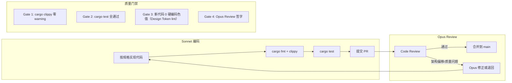

### 21.5 Sonnet 输入规格模板

每次分配 Sonnet 任务时，提供以下输入：

```markdown
## 任务: [任务名称]

### 规格引用

- 计划文档: §X.Y（具体章节）
- UI 规范: 篇二 §2.Z（设计 token / 组件规格）
- 数据模型: §10（Block 结构定义）

### 模板代码

[Opus 提供的参考实现或 trait 定义]

### 验收标准

1. cargo clippy --workspace -- -D warnings 通过
2. cargo test 覆盖 [列出具体测试]
3. 使用语义 token（不硬编码色值/字号/间距）
4. [其他具体要求]

### 禁止事项

- 不得修改 trait 签名（Opus 专属）
- 不得新增 unsafe 代码
- 不得引入新的外部依赖（需 Opus 审批）
```
