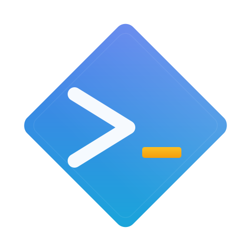

<p align="center">
  
  <br><br>
  <strong>C O D I N E E R</strong>
  <br>
  <em>你的本地 AI 编程助手 — 单一二进制，零云端锁定。</em>
</p>

<p align="center">
  <a href="https://github.com/andeya/codineer/actions"></a>
  <a href="https://github.com/andeya/codineer/releases"></a>
  <a href="https://crates.io/crates/codineer-cli"></a>
  
  <br>
  <a href="README.md">English</a>
</p>

---

**Codineer** 将你的终端变成 AI 编程伙伴。它读取工作区、理解项目上下文，帮你编写、重构、调试和交付代码 — 全程无需离开命令行。

安全 Rust 构建，**单个二进制文件**。无守护进程，无云端依赖 — 自带 API Key 即可开始。

## 安装

选择最适合你的方式：

### Homebrew（macOS / Linux）

```bash
brew install andeya/codineer/codineer
```

### Cargo（从 crates.io）

```bash
cargo install codineer-cli
```

### 下载二进制

前往 **[Releases](https://github.com/andeya/codineer/releases)** 页面下载：

| 平台                  | 文件                                          |
| --------------------- | --------------------------------------------- |
| macOS (Apple Silicon) | `codineer-*-aarch64-apple-darwin.tar.gz`      |
| macOS (Intel)         | `codineer-*-x86_64-apple-darwin.tar.gz`       |
| Linux (x86_64)        | `codineer-*-x86_64-unknown-linux-gnu.tar.gz`  |
| Linux (ARM64)         | `codineer-*-aarch64-unknown-linux-gnu.tar.gz` |
| Windows (x86_64)      | `codineer-*-x86_64-pc-windows-msvc.zip`       |

### 从源码构建

```bash
git clone https://github.com/andeya/codineer.git
cd codineer
cargo install --path crates/codineer-cli --locked
```

## 快速开始

**1. 设置 API Key**（任选一个）：

```bash
export ANTHROPIC_API_KEY="sk-ant-..."   # Claude
export XAI_API_KEY="xai-..."            # Grok
export OPENAI_API_KEY="sk-..."          # GPT
codineer login                          # 或使用 OAuth
```

**2. 开始编码：**

```bash
codineer                                       # 交互式 REPL
codineer prompt "解释这个项目的架构"             # 一次性提问
codineer -p "列出所有 TODO" --output-format json # 脚本集成
```

Codineer 会自动检测可用的 API 供应商，无需额外配置。

## 核心能力

- **理解你的项目** — 读取 `CODINEER.md`、项目配置、Git 状态、LSP 诊断
- **丰富的工具** — Shell 执行、文件读写编辑、Glob/Grep 搜索、网页抓取、Notebook
- **上下文管理** — 会话保存/恢复、压缩、对话历史
- **灵活扩展** — MCP 服务器（stdio/SSE/HTTP/WebSocket）、插件、自定义 Agent 和 Skill
- **安全可控** — 沙箱执行、权限模式、隐私优先
- **全平台** — macOS、Linux、Windows；Anthropic、OpenAI、xAI、Ollama

## 配置

按优先级从高到低加载：

1. `.codineer/settings.local.json` — 本地覆盖（已 gitignore）
2. `.codineer/settings.json` — 项目级配置
3. `~/.codineer/settings.json` — 用户全局配置

运行 `codineer help` 查看完整文档。

## 许可证

[MIT](LICENSE)

---

<p align="center">
  由 <a href="https://github.com/andeya">andeya</a> 使用 🦀 构建
</p>
